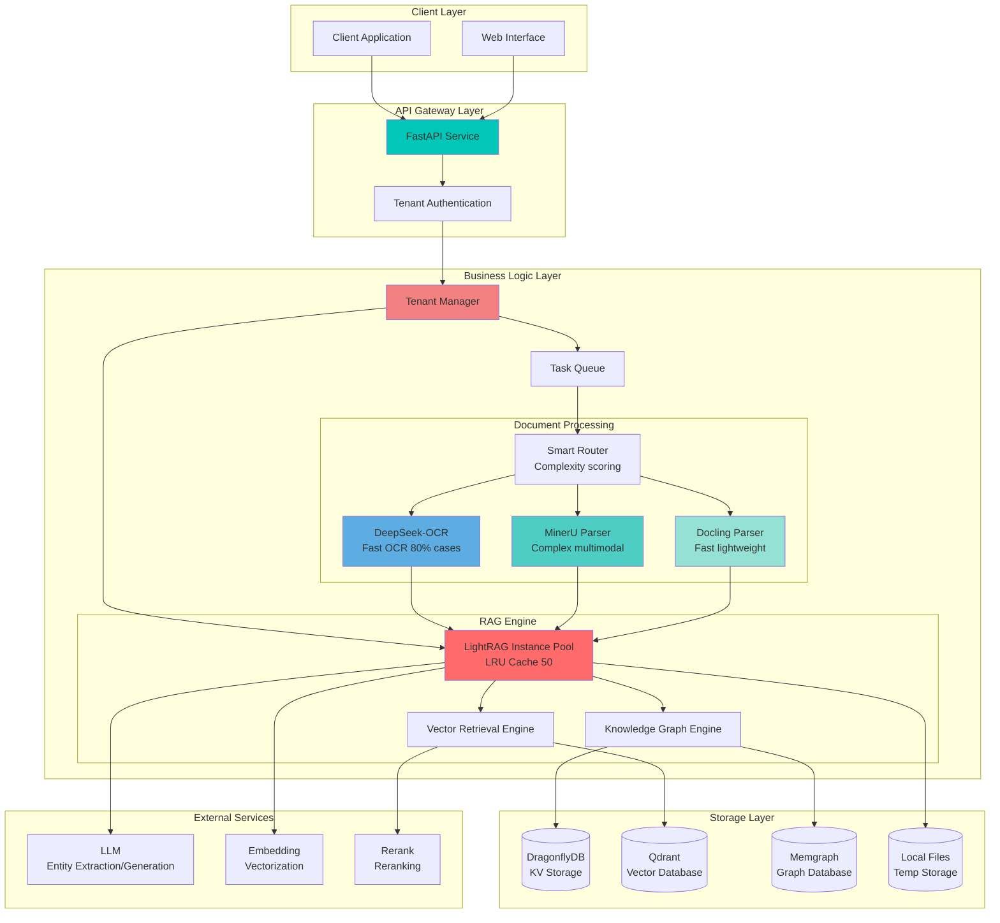
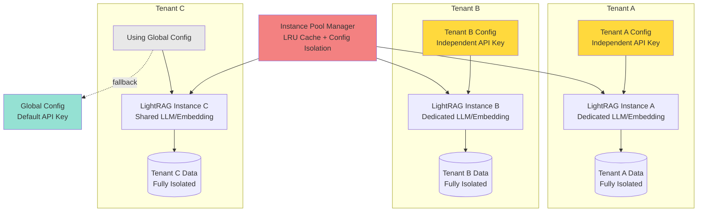

<div align="center">

# 🚀 RAG API

**Multi-tenant Multimodal Document Intelligent Retrieval System**

Enterprise-grade RAG service built on RAG-Anything and LightRAG

[](https://github.com/BukeLy/rag-api/actions/workflows/ci-basic.yml)
[](https://www.python.org/)
[](https://fastapi.tiangolo.com/)
[](https://github.com/HKUDS/LightRAG)
[](https://www.docker.com/)
[](LICENSE)

[English](README.md) | [简体中文](README.zh-CN.md)

[Features](#✨-features) • [Quick Start](#🚀-quick-start) • [Architecture](#🏗️-architecture) • [API Documentation](#📚-api-documentation) • [Deployment](#🛠️-deployment)

</div>

---

## 📖 Introduction

RAG API is an enterprise-grade Retrieval-Augmented Generation (RAG) service that combines the powerful document parsing capabilities of **RAG-Anything** with the efficient knowledge graph retrieval technology of **LightRAG**, providing intelligent Q&A capabilities for your documents.

### 🎯 Key Highlights

- 🏢 **Multi-tenant Isolation** - Complete tenant data isolation for enterprise multi-tenant scenarios
- 🎨 **Multimodal Parsing** - Support for PDF, Word, images and more, with full OCR, tables, and formulas coverage
- ⚡ **High-performance Retrieval** - Knowledge graph-based hybrid retrieval with 6-15 second query response
- 🔄 **Flexible Deployment** - Support for production and development modes with one-click switching
- 📦 **Ready to Use** - One-click Docker deployment, service starts in 3 minutes
- 🎛️ **Multiple Parsing Engines** - DeepSeek-OCR (Remote API) + MinerU (Local/Remote API) + Docling (Fast)
- 🎨 **RAG-Anything VLM Enhancement** - Three modes (off/selective/full) for deep chart understanding
- 💾 **Task Persistence** - Redis storage support, tasks recoverable after container restart/instance rebuild

---

## ✨ Features

<table>
<tr>
<td width="50%">

### 📄 Document Processing

- ✅ **Multiple Format Support**
  - PDF, Word, Excel, PPT
  - PNG, JPG, WebP images
  - TXT, Markdown text
  
- ✅ **Intelligent Parsing**
  - Plain text (.txt, .md) → Direct insertion (ultra-fast ~1s, skip parser)
  - OCR text recognition
  - Structured table extraction
  - Mathematical formula recognition
  - Layout analysis

- ✅ **RAG-Anything VLM Enhancement** 🆕
  - `off` - Markdown only (fastest)
  - `selective` - Selective processing of important charts
  - `full` - Complete context enhancement processing
  - Smart filtering: with titles, large size, first page content
  - ⚠️ **Only supports remote MinerU mode, local mode uses RAG-Anything native methods**

- ✅ **Batch Processing**
  - Up to 100 files per batch
  - Async task queue
  - Real-time progress tracking

</td>
<td width="50%">

### 🔍 Intelligent Retrieval

- ✅ **Multi-mode Query**
  - `naive` - Vector retrieval (fastest)
  - `local` - Local graph
  - `global` - Global graph
  - `hybrid` - Hybrid retrieval
  - `mix` - Full retrieval (most accurate)

- ✅ **Knowledge Graph**
  - Automatic entity extraction
  - Relationship reasoning
  - Semantic understanding
  - Context enhancement

- ✅ **External Storage**
  - DragonflyDB (KV storage + task storage)
  - Qdrant (vector storage)
  - Memgraph (graph database)
  - Task persistence (Redis mode)

</td>
</tr>
</table>

---

## 🏗️ Architecture

### System Architecture Diagram



### Multi-tenant Architecture



### Core Technology Stack

<table>
<tr>
<td width="33%">

**🔧 Frameworks & Runtime**
- FastAPI 0.115+
- Python 3.11+
- Uvicorn
- Docker & Docker Compose

</td>
<td width="33%">

**🧠 AI & RAG**
- LightRAG 1.4.9.4
- RAG-Anything
- MinerU (PDF-Extract-Kit)
- Docling

</td>
<td width="33%">

**💾 Storage & Database**
- DragonflyDB（Redis compatible）
- Qdrant（Vector Database）
- Memgraph（Graph Database）
- Local filesystem

</td>
</tr>
</table>

---

## 🚀 Quick Start

### Option 1: One-click Deployment (Recommended)

Suitable for production and testing environments:

```bash
# 1. Clone the project
git clone https://github.com/BukeLy/rag-api.git
cd rag-api

# 2. Configure environment variables
cp env.example .env
nano .env  # Fill in your API keys

# 3. Run deployment script
chmod +x deploy.sh
./deploy.sh

# Select deployment mode:
# 1) Production Mode - Standard container deployment
# 2) Development Mode - Code hot-reload

# 4. Verify service
curl http://localhost:8000/
```

**Access Swagger Documentation:** http://localhost:8000/docs

### Option 2: Docker Compose

#### Production Mode

```bash
# Configure environment variables
cp env.example .env
nano .env

# Start services
docker compose -f docker-compose.yml up -d

# View logs
docker compose -f docker-compose.yml logs -f
```

#### Development Mode (Code Hot-reload)

```bash
# Start development environment
docker compose -f docker-compose.dev.yml up -d

# Or use quick script
./scripts/dev.sh

# Code changes will auto-reload without restart
```

### Option 3: Local Development

```bash
# Install uv (Python package manager)
curl -LsSf https://astral.sh/uv/install.sh | sh

# Install dependencies
uv sync

# Configure environment variables
cp env.example .env
nano .env

# Start services
uv run uvicorn main:app --host 0.0.0.0 --port 8000 --reload
```

### Environment Variable Configuration

Minimum configuration (required):

```bash
# LLM Configuration (Function-oriented naming)
LLM_API_KEY=your_llm_api_key
LLM_BASE_URL=https://ark.cn-beijing.volces.com/api/v3
LLM_MODEL=ep-xxx-xxx
# LLM_REQUESTS_PER_MINUTE=800        # Rate limit (optional)
# LLM_TOKENS_PER_MINUTE=40000        # Rate limit (optional)
# LLM_MAX_ASYNC=8                    # [Optional, expert mode] Manual concurrency control
#                                    # Auto-calculated when unset: min(RPM, TPM/3500) = 11

# Embedding Configuration (Function-oriented naming)
EMBEDDING_API_KEY=your_embedding_api_key
EMBEDDING_BASE_URL=https://api.siliconflow.cn/v1
EMBEDDING_MODEL=Qwen/Qwen3-Embedding-0.6B
EMBEDDING_DIM=1024
# EMBEDDING_MAX_ASYNC=32             # [Optional, expert mode] Auto-calculated when unset: 800

# MinerU Mode (Remote recommended)
MINERU_MODE=remote
MINERU_API_TOKEN=your_token
MINERU_HTTP_TIMEOUT=60              # MinerU download timeout (seconds, default 60)
FILE_SERVICE_BASE_URL=http://your-ip:8000

# VLM Chart Enhancement Configuration 🆕
# ⚠️ Note: Only effective in MINERU_MODE=remote
RAG_VLM_MODE=off                    # off / selective / full
RAG_IMPORTANCE_THRESHOLD=0.5        # Importance threshold (selective mode)
RAG_CONTEXT_WINDOW=2                # Context window (full mode)
RAG_CONTEXT_MODE=page               # page / chunk
RAG_MAX_CONTEXT_TOKENS=3000         # Max context tokens

# Task Storage Configuration 🆕
TASK_STORE_STORAGE=redis            # memory / redis (production recommends redis)

# Document Insert Verification Configuration 🆕
DOC_INSERT_VERIFICATION_TIMEOUT=300        # Verification timeout (seconds, default 5 minutes)
DOC_INSERT_VERIFICATION_POLL_INTERVAL=0.5  # Poll interval (seconds, default 500ms)

# Model Call Timeout Configuration 🆕
MODEL_CALL_TIMEOUT=90               # Model call max timeout (seconds, default 90)
```

**⚡ Auto Concurrency Calculation**:
- **LLM**: When `LLM_MAX_ASYNC` is unset, auto-calculated as `min(RPM, TPM/3500)` ≈ 11
- **Embedding**: When `EMBEDDING_MAX_ASYNC` is unset, auto-calculated as `min(RPM, TPM/500)` ≈ 800
- **Rerank**: When `RERANK_MAX_ASYNC` is unset, auto-calculated as `min(RPM, TPM/500)` ≈ 800

**✅ Recommended**: Don't set `*_MAX_ASYNC`, let the system auto-calculate to completely avoid 429 errors

See `env.example` for complete configuration.

---

## 📚 API Documentation

### Core Endpoints

#### 1️⃣ Upload Document

```bash
# Single file upload (default mode)
curl -X POST "http://localhost:8000/insert?tenant_id=your_tenant&doc_id=doc1" \
  -F "file=@document.pdf" \
  -F "parser=auto"

# VLM chart enhancement mode 🆕
# off: Markdown only (fastest, default)
curl -X POST "http://localhost:8000/insert?tenant_id=your_tenant&doc_id=doc2&vlm_mode=off" \
  -F "file=@document.pdf"

# selective: Selective processing of important charts (balance performance and quality)
curl -X POST "http://localhost:8000/insert?tenant_id=your_tenant&doc_id=doc3&vlm_mode=selective" \
  -F "file=@document.pdf"

# full: Complete RAG-Anything processing (highest quality, context enhancement enabled)
curl -X POST "http://localhost:8000/insert?tenant_id=your_tenant&doc_id=doc4&vlm_mode=full" \
  -F "file=@document.pdf"

# Response
{
  "task_id": "task-xxx-xxx",
  "doc_id": "doc1",
  "filename": "document.pdf",
  "vlm_mode": "off",
  "status": "pending"
}
```

#### 2️⃣ Batch Upload

```bash
curl -X POST "http://localhost:8000/batch?tenant_id=your_tenant" \
  -F "files=@doc1.pdf" \
  -F "files=@doc2.docx" \
  -F "files=@image.png"

# Response
{
  "batch_id": "batch-xxx-xxx",
  "total_files": 3,
  "accepted_files": 3,
  "tasks": [...]
}
```

#### 3️⃣ Intelligent Query (Query API v2.0)

**New Advanced Features**:
- ✨ **Conversation History**: Support for multi-turn conversation context
- ✨ **Custom Prompts**: Customize response style
- ✨ **Response Format Control**: paragraph/list/json
- ✨ **Keyword Precision Retrieval**: hl_keywords/ll_keywords
- ✨ **Streaming Output**: Real-time generation viewing

```bash
# Basic query
curl -X POST "http://localhost:8000/query?tenant_id=your_tenant" \
  -H "Content-Type: application/json" \
  -d '{
    "query": "What are the core viewpoints in the document?",
    "mode": "hybrid"
  }'

# Advanced query (multi-turn dialogue + custom prompt)
curl -X POST "http://localhost:8000/query?tenant_id=your_tenant" \
  -H "Content-Type: application/json" \
  -d '{
    "query": "Can you elaborate on the second point?",
    "mode": "hybrid",
    "conversation_history": [
      {"role": "user", "content": "What are the key points?"},
      {"role": "assistant", "content": "There are mainly three points..."}
    ],
    "user_prompt": "Please answer in professional academic language",
    "response_type": "list"
  }'

# Streaming query (SSE)
curl -N -X POST "http://localhost:8000/query/stream?tenant_id=your_tenant" \
  -H "Content-Type: application/json" \
  -d '{
    "query": "What are the core viewpoints in the document?",
    "mode": "hybrid"
  }'

# Response (real-time streaming output)
data: {"chunk": "Based on", "done": false}
data: {"chunk": "document content", "done": false}
data: {"done": true}
```

#### 4️⃣ Task Status Query

```bash
curl "http://localhost:8000/task/task-xxx-xxx?tenant_id=your_tenant"

# Response
{
  "task_id": "task-xxx-xxx",
  "status": "completed",
  "progress": 100,
  "result": {...}
}
```

#### 5️⃣ Tenant Management

```bash
# Get tenant statistics
curl "http://localhost:8000/tenants/stats?tenant_id=your_tenant"

# Clear tenant cache
curl -X DELETE "http://localhost:8000/tenants/cache?tenant_id=your_tenant"

# View instance pool status (admin)
curl "http://localhost:8000/tenants/pool/stats"
```

### VLM Mode Comparison 🆕

| Mode | Speed | Quality | Resource Usage | Use Case |
|------|------|------|----------|---------|
| `off` | ⚡⚡⚡⚡⚡ | ⭐⭐⭐ | Very Low | Plain text documents, fast batch processing |
| `selective` | ⚡⚡⚡⚡ | ⭐⭐⭐⭐ | Low | Documents with key charts (recommended) |
| `full` | ⚡⚡ | ⭐⭐⭐⭐⭐ | High | Chart-intensive research reports, papers |

**Processing Time Estimate** (20-page PDF example):
- `off`: ~10 seconds(Markdown only)
- `selective`: ~30 seconds(5-10 important charts)
- `full`: ~120 seconds(complete context processing)

### Query Mode Comparison

| Mode | Speed | Accuracy | Use Case |
|------|------|--------|---------|
| `naive` | ⚡⚡⚡⚡⚡ | ⭐⭐⭐ | Simple Q&A, fast retrieval |
| `local` | ⚡⚡⚡⚡ | ⭐⭐⭐⭐ | Local entity relationship queries |
| `global` | ⚡⚡⚡ | ⭐⭐⭐⭐ | Global knowledge graph reasoning |
| `hybrid` | ⚡⚡⚡ | ⭐⭐⭐⭐⭐ | Hybrid retrieval (recommended) |
| `mix` | ⚡⚡ | ⭐⭐⭐⭐⭐ | Complex questions, deep analysis |

### Query API v2.0 Advanced Parameters

| Parameter | Type | Description | Example |
|------|------|------|------|
| `conversation_history` | List[Dict] | Multi-turn conversation context | `[{"role": "user", "content": "..."}]` |
| `user_prompt` | str | Custom prompt | "Please answer in professional academic language" |
| `response_type` | str | Response format | "paragraph", "list", "json" |
| `hl_keywords` | List[str] | High priority keywords | `["artificial intelligence", "machine learning"]` |
| `ll_keywords` | List[str] | Low priority keywords | `["application", "case study"]` |
| `only_need_context` | bool | Return context only (debug) | `true` |
| `max_entity_tokens` | int | Entity token limit | `6000` |

Complete API documentation:http://localhost:8000/docs

---

## 🎯 Usage Examples

### Python SDK

```python
import requests

# Configuration
BASE_URL = "http://localhost:8000"
TENANT_ID = "your_tenant"

# Upload document
with open("document.pdf", "rb") as f:
    response = requests.post(
        f"{BASE_URL}/insert",
        params={"tenant_id": TENANT_ID, "doc_id": "doc1"},
        files={"file": f}
    )
    task_id = response.json()["task_id"]
    print(f"Task ID: {task_id}")

# Query
response = requests.post(
    f"{BASE_URL}/query",
    params={"tenant_id": TENANT_ID},
    json={
        "query": "What is the main content of the document?",
        "mode": "hybrid",
        "top_k": 10
    }
)
result = response.json()
print(f"Answer: {result['answer']}")
```

### Complete cURL Example

```bash
# 1. Upload PDF document
TASK_ID=$(curl -X POST "http://localhost:8000/insert?tenant_id=demo&doc_id=report" \
  -F "file=@report.pdf" | jq -r '.task_id')

echo "Task ID: $TASK_ID"

# 2. Wait for processing completion
while true; do
  STATUS=$(curl -s "http://localhost:8000/task/$TASK_ID?tenant_id=demo" | jq -r '.status')
  echo "Status: $STATUS"
  if [ "$STATUS" = "completed" ] || [ "$STATUS" = "failed" ]; then
    break
  fi
  sleep 2
done

# 3. Query document content
curl -X POST "http://localhost:8000/query?tenant_id=demo" \
  -H "Content-Type: application/json" \
  -d '{
    "query": "What are the main conclusions of this report?",
    "mode": "hybrid"
  }' | jq '.answer'
```

---

## 🛠️ Deployment

### System Requirements

**Minimum Configuration:**
- CPU: 2 cores
- RAM: 4GB
- Disk: 40GB SSD
- OS: Ubuntu 20.04+ / Debian 11+ / CentOS 8+

**Recommended Configuration (Production):**
- CPU: 4 cores
- RAM: 8GB
- Disk: 100GB SSD
- OS: Ubuntu 22.04 LTS

### Server Deployment

#### Quick Deployment on Aliyun/Tencent Cloud

```bash
# SSH login to server
ssh root@your-server-ip

# Clone project
git clone https://github.com/BukeLy/rag-api.git
cd rag-api

# Run one-click deployment script
chmod +x deploy.sh
./deploy.sh

# The script will automatically:
# 1. Install Docker and Docker Compose
# 2. Configure environment variables
# 3. Optimize system parameters
# 4. Start services
# 5. Verify health status
```

#### External Storage Configuration

Supports DragonflyDB + Qdrant + Memgraph external storage (enabled by default):

```bash
# Configure in .env
USE_EXTERNAL_STORAGE=true

# DragonflyDB configuration (KV Storage)
KV_STORAGE=RedisKVStorage
REDIS_URI=redis://dragonflydb:6379/0

# Qdrant configuration (vector storage)
VECTOR_STORAGE=QdrantVectorDBStorage
QDRANT_URL=http://qdrant:6333

# Memgraph configuration (graph storage)
GRAPH_STORAGE=MemgraphStorage
MEMGRAPH_URI=bolt://memgraph:7687
MEMGRAPH_USERNAME=
MEMGRAPH_PASSWORD=
```

See [External Storage Deployment Documentation](docs/DEPLOYMENT_EXTERNAL_STORAGE.md)。

### Docker Compose Configuration

The project provides two configuration files:

| File | Purpose | Features |
|------|------|------|
| `docker-compose.yml` | Production mode | Code packaged in image, optimal performance |
| `docker-compose.dev.yml` | Development mode | Code mounted externally, supports hot-reload |

Select configuration file:

```bash
# Production mode
docker compose -f docker-compose.yml up -d

# Development mode
docker compose -f docker-compose.dev.yml up -d
```

### Performance Optimization

#### Tuning Parameters

Configure in `.env`:

```bash
# ⚡ Concurrency Control (Recommended: use auto-calculation)
# LLM_MAX_ASYNC=8                    # [Expert mode] Manually specify LLM concurrency
#                                    # Auto-calculated when unset: min(RPM, TPM/3500) ≈ 11
# EMBEDDING_MAX_ASYNC=32             # [Expert mode] Manually specify Embedding concurrency
#                                    # Auto-calculated when unset: min(RPM, TPM/500) ≈ 800
# RERANK_MAX_ASYNC=16                # [Expert mode] Manually specify Rerank concurrency
#                                    # Auto-calculated when unset: min(RPM, TPM/500) ≈ 800

# Retrieval count (affects query quality and speed)
TOP_K=20  # Entity/relationship retrieval count
CHUNK_TOP_K=10  # Text chunk retrieval count

# Document processing concurrency
DOCUMENT_PROCESSING_CONCURRENCY=10  # Remote mode can be set high, local mode set to 1
```

**🎯 Concurrency Configuration Recommendations**:
- **Recommended**: Don't set `*_MAX_ASYNC`, let the system auto-calculate based on TPM/RPM
- **Expert mode**: If manual control needed, can set `LLM_MAX_ASYNC` and other parameters
- **Advantage**: Auto-calculation completely avoids 429 errors (TPM limit reached)

#### Mode Selection

- **MinerU Remote Mode (Recommended)**: High concurrency, resource-efficient
- **MinerU Local Mode**: Requires GPU, high memory usage
- **Docling Mode**: Fast and lightweight, suitable for simple documents

---

## 🏢 Multi-tenant Usage

### Tenant Isolation

Each tenant has:
- ✅ Independent LightRAG instance
- ✅ Isolated data storage space
- ✅ Independent vector index
- ✅ Dedicated knowledge graph
- ✅ **Independent service configuration** (LLM, Embedding, Rerank, DeepSeek-OCR, MinerU)🆕

### Tenant Configuration Management 🆕

Each tenant can independently configure 5 services with hot-reload support:

```bash
# 1️⃣ Configure independent DeepSeek-OCR API key for Tenant A
curl -X PUT "http://localhost:8000/tenants/tenant_a/config" \
  -H "Content-Type: application/json" \
  -d '{
    "ds_ocr_config": {
      "api_key": "sk-tenant-a-ds-ocr-key",
      "base_url": "https://api.siliconflow.cn/v1",
      "model": "deepseek-ai/DeepSeek-OCR",
      "timeout": 90
    }
  }'

# 2️⃣ Configure independent MinerU API token for Tenant B
curl -X PUT "http://localhost:8000/tenants/tenant_b/config" \
  -H "Content-Type: application/json" \
  -d '{
    "mineru_config": {
      "api_token": "tenant-b-mineru-token",
      "base_url": "https://mineru.net",
      "model_version": "vlm"
    }
  }'

# 3️⃣ Configure multiple services simultaneously (LLM + Embedding + DeepSeek-OCR)
curl -X PUT "http://localhost:8000/tenants/tenant_c/config" \
  -H "Content-Type: application/json" \
  -d '{
    "llm_config": {
      "api_key": "sk-tenant-c-llm-key",
      "model": "gpt-4"
    },
    "embedding_config": {
      "api_key": "sk-tenant-c-embedding-key",
      "model": "Qwen/Qwen3-Embedding-0.6B",
      "dim": 1024
    },
    "ds_ocr_config": {
      "api_key": "sk-tenant-c-ds-ocr-key"
    }
  }'

# 4️⃣ Query tenant configuration (API key auto-masked)
curl "http://localhost:8000/tenants/tenant_a/config"

# Response example
{
  "tenant_id": "tenant_a",
  "ds_ocr_config": {
    "api_key": "sk-***-key",  // Auto-masked
    "timeout": 90
  },
  "merged_config": {
    "llm": {...},        // Using Global Config
    "embedding": {...},  // Using Global Config
    "rerank": {...},     // Using Global Config
    "ds_ocr": {...},     // Using tenant config
    "mineru": {...}      // Using Global Config
  }
}

# 5️⃣ Refresh config cache (config hot-reload)
curl -X POST "http://localhost:8000/tenants/tenant_a/config/refresh"

# 6️⃣ Delete tenant config (restore to global config)
curl -X DELETE "http://localhost:8000/tenants/tenant_a/config"
```

**Supported Configuration Items**:

| Service | Config Field | Description |
|------|---------|------|
| **LLM** | `llm_config` | Model, API key, base_url, etc. |
| **Embedding** | `embedding_config` | Model, API key, dimension, etc. |
| **Rerank** | `rerank_config` | Model, API key, etc. |
| **DeepSeek-OCR** | `ds_ocr_config` | API key, timeout, mode, etc. |
| **MinerU** | `mineru_config` | API token, version, timeout, etc. |

**Configuration Priority**: Tenant config > Global config

**Use Cases**:
- 🔐 **Multi-tenant SaaS**: Each tenant uses their own API key
- 💰 **Pay-per-use**: Track tenant usage through independent API keys
- 🎯 **Differentiated Services**: Different tenants use different models (GPT-4 vs GPT-3.5)
- 🧪 **A/B Testing**: Compare different models/parameters

### Usage

All APIs require `tenant_id` parameter:

```bash
# Tenant A upload document
curl -X POST "http://localhost:8000/insert?tenant_id=tenant_a&doc_id=doc1" \
  -F "file=@doc.pdf"

# Tenant B upload document (fully isolated)
curl -X POST "http://localhost:8000/insert?tenant_id=tenant_b&doc_id=doc1" \
  -F "file=@doc.pdf"

# Tenant A query (can only query own documents)
curl -X POST "http://localhost:8000/query?tenant_id=tenant_a" \
  -H "Content-Type: application/json" \
  -d '{"query": "document content", "mode": "hybrid"}'
```

### Instance Pool Management

- **Capacity**: Cache up to 50 tenant instances
- **Strategy**: LRU (Least Recently Used) automatic cleanup
- **Config Isolation**: Each tenant can use independent LLM, Embedding, parser configuration

---

## 📊 Monitoring & Maintenance

### Common Commands

```bash
# View service status
docker compose ps

# View real-time logs
docker compose logs -f

# Restart services
docker compose restart

# Stop services
docker compose down

# View resource usage
docker stats

# Clean Docker resources
docker system prune -f
```

### Maintenance Scripts

```bash
# Monitor service health
./scripts/monitor.sh

# Backup data
./scripts/backup.sh

# Update services
./scripts/update.sh

# Performance testing
./scripts/test_concurrent_perf.sh

# Performance monitoring
./scripts/monitor_performance.sh
```

### Health Checks

```bash
# Complete health check (recommended)
./scripts/health_check.sh
./scripts/health_check.sh --verbose  # verbose output

# API health check
curl http://localhost:8000/

# Tenant statistics
curl "http://localhost:8000/tenants/stats?tenant_id=your_tenant"

# Instance pool status
curl "http://localhost:8000/tenants/pool/stats"
```

---

## 🗂️ Project Structure

```
rag-api/
├── main.py                 # FastAPI application entry
├── api/                    # API route modules
│   ├── __init__.py         # Route aggregation
│   ├── insert.py           # Document upload (single/batch)
│   ├── query.py            # Intelligent query
│   ├── task.py             # Task status query
│   ├── tenant.py           # Tenant management
│   ├── files.py            # File service
│   ├── models.py           # Pydantic models
│   └── task_store.py       # Task storage
├── src/                    # Core business logic
│   ├── rag.py              # LightRAG lifecycle management
│   ├── multi_tenant.py     # Multi-tenant instance manager
│   ├── tenant_deps.py      # Tenant dependency injection
│   ├── logger.py           # Unified logging
│   ├── metrics.py          # Performance metrics
│   ├── file_url_service.py # Temporary file service
│   ├── mineru_client.py    # MinerU client
│   └── mineru_result_processor.py  # Result processing
├── docs/                   # Documentation
│   ├── ARCHITECTURE.md     # Architecture design documentation
│   ├── USAGE.md            # Detailed usage guide
│   ├── DEPLOY_MODES.md     # Deployment mode description
│   ├── PR_WORKFLOW.md      # PR workflow
│   └── ...
├── scripts/                # Maintenance scripts
│   ├── dev.sh              # Development mode quick start
│   ├── monitor.sh          # Service monitoring
│   ├── backup.sh           # Data backup
│   ├── update.sh           # Service update
│   └── ...
├── deploy.sh               # One-click deployment script
├── docker-compose.yml      # Production mode configuration
├── docker-compose.dev.yml  # Development mode configuration
├── Dockerfile              # Production image
├── Dockerfile.dev          # Development image
├── pyproject.toml          # Project dependencies
├── uv.lock                 # Dependency lock
├── env.example             # Environment variable template
├── CLAUDE.md               # Claude AI guide
└── README.md               # This documentation
```

---

## 🐛 Troubleshooting

### Common Issues

<details>
<summary><b>Q1: What to do if service fails to start?</b></summary>

```bash
# View detailed logs
docker compose logs

# Check port usage
netstat -tulpn | grep 8000

# Check Docker status
docker ps -a
```
</details>

<details>
<summary><b>Q2: multimodal_processed error?</b></summary>

**Note**: This issue has been fixed in LightRAG 1.4.9.4+. If you encounter this error, your version is outdated.

**Solution**:
```bash
# Option 1: Upgrade to latest version (recommended)
# Modify LightRAG version in pyproject.toml
# lightrag = "^1.4.9.4"

# Rebuild image
docker compose down
docker compose up -d --build

# Option 2: Clean old data (temporary solution)
rm -rf ./rag_local_storage
docker compose restart
```
</details>

<details>
<summary><b>Q3: File upload returns 400 error?</b></summary>

Check:
- File format supported (PDF, DOCX, PNG, JPG, etc.)
- File size exceeds 100MB
- File is empty

```bash
# View supported formats
curl http://localhost:8000/docs
```
</details>

<details>
<summary><b>Q3.5: Embedding dimension error?</b></summary>

If you encounter dimension-related errors, need to clean data and rebuild:

```bash
# Stop services
docker compose down

# Delete all volumes (clear database)
docker volume rm rag-api_dragonflydb_data rag-api_qdrant_data rag-api_memgraph_data

# Modify EMBEDDING_DIM in .env
EMBEDDING_DIM=1024  # or 4096, must match the model

# Restart
docker compose up -d
```
</details>

<details>
<summary><b>Q4: Query is very slow (>30 seconds)?</b></summary>

Optimization suggestions:
1. Use `naive` or `hybrid` mode instead of `mix`
2. Increase `MAX_ASYNC` parameter (in `.env`)
3. Reduce `TOP_K` and `CHUNK_TOP_K`
4. Enable Reranker

```bash
# Modify .env
MAX_ASYNC=8
TOP_K=20
CHUNK_TOP_K=10
```
</details>

<details>
<summary><b>Q5: Out of memory (OOM)?</b></summary>

If using local MinerU:
```bash
# Switch to remote mode
# Modify in .env
MINERU_MODE=remote
MINERU_API_TOKEN=your_token

# Or limit concurrency
DOCUMENT_PROCESSING_CONCURRENCY=1
```
</details>

<details>
<summary><b>Q6: Tasks lost after container restart?</b></summary>

**Problem Symptoms**:
- Cannot query previous task status after container restart
- Tasks disappear after tenant instance evicted by LRU

**Solution**: Enable Redis task storage

```bash
# Modify .env
TASK_STORE_STORAGE=redis

# Restart services
docker compose restart

# Verify
docker compose logs api | grep TaskStore
# Should see: ✅ TaskStore: Redis connection successful
```

**Configuration Description**:
- `memory` mode: In-memory storage, data lost after restart (default, suitable for development)
- `redis` mode: Persistent storage, supports container restart and instance rebuild (production recommended)

**TTL Strategy** (Redis mode auto-cleanup):
- completed tasks: 24 hours
- failed tasks: 24 hours
- pending/processing tasks: 6 hours
</details>

<details>
<summary><b>Q7: VLM mode processing failed?</b></summary>

**Check Items**:
1. **vision_model_func not configured**
   - Check logs:`vision_model_func not found, fallback to off mode`
   - Ensure LLM API is configured in `.env`

2. **Image file does not exist**
   - Check logs:`Image file not found: xxx`
   - Possibly corrupted MinerU ZIP or extraction failed

3. **Timeout error**
   - `full` mode may timeout on large files
   - Suggestion: Use `selective` mode first, or increase `VLM_TIMEOUT`

```bash
# Modify .env
VLM_TIMEOUT=300  # Increase to 5 minutes
RAG_VLM_MODE=selective  # downgrade to selective
```

**Debugging Tips**:
```bash
# View detailed logs
docker compose logs -f | grep VLM

# Test single file
curl -X POST 'http://localhost:8000/insert?tenant_id=test&doc_id=test&vlm_mode=off' \
  -F 'file=@test.pdf'
```
</details>

### Performance Tuning Recommendations

| Scenario | MAX_ASYNC | TOP_K | CHUNK_TOP_K | MINERU_MODE |
|------|-----------|-------|-------------|-------------|
| Fast response | 8 | 10 | 5 | remote |
| Balanced mode | 8 | 20 | 10 | remote |
| High accuracy | 4 | 60 | 20 | remote |
| Resource limited | 4 | 20 | 10 | remote |

---

## 📖 Documentation

- [📘 Architecture Design Documentation](docs/ARCHITECTURE.md) - Detailed system architecture and design concepts
- [📗 Usage Guide](docs/USAGE.md) - Complete API usage documentation and examples
- [📙 Deployment Mode Description](docs/DEPLOY_MODES.md) - Production mode vs Development mode
- [📕 PR Workflow](docs/PR_WORKFLOW.md) - Process guide for code contribution
- [📔 External Storage Deployment](docs/DEPLOYMENT_EXTERNAL_STORAGE.md) - Redis/PostgreSQL/Neo4j configuration
- [📊 API Comparison Analysis](docs/API_COMPARISON.md) - rag-api vs LightRAG official API comparison
- [🌐 WebUI Integration Guide](docs/LIGHTRAG_WEBUI_INTEGRATION.md) - Knowledge graph visualization integration

---

## 🤝 Contributing

We welcome all forms of contribution!

### How to Contribute

1. **Fork the project**

```bash
git clone https://github.com/BukeLy/rag-api.git
cd rag-api
```

2. **Create feature branch**

```bash
git checkout -b feature/your-feature-name
```

3. **Development and Testing**

```bash
# Install dependencies
uv sync

# Run tests
uv run pytest

# Code formatting
uv run black .
uv run isort .
```

4. **Submit code**

```bash
git add .
git commit -m "feat: Add new feature"
git push origin feature/your-feature-name
```

5. **Create Pull Request**

Create a PR on GitHub with detailed description of your changes.

### Commit Conventions

Use semantic commit messages:

- `feat:` New feature
- `fix:` Bug fix
- `docs:` Documentation update
- `style:` Code formatting
- `refactor:` Code refactoring
- `perf:` Performance optimization
- `test:` Testing
- `chore:` Build/tools

See [PR Workflow Documentation](docs/PR_WORKFLOW.md)。

---

## 📄 License

This project is licensed under the MIT License. See the [LICENSE](LICENSE) file for details.

---

## 🙏 Acknowledgments

This project is built on the following excellent open source projects:

- [LightRAG](https://github.com/HKUDS/LightRAG) - Efficient knowledge graph RAG framework
- [RAG-Anything](https://github.com/your-org/rag-anything) - Multimodal document parsing
- [MinerU](https://github.com/opendatalab/MinerU) - Powerful PDF parsing tool
- [Docling](https://github.com/DS4SD/docling) - Lightweight document parsing
- [FastAPI](https://fastapi.tiangolo.com/) - Modern Python web framework

Special thanks to all contributors and users for their support! 🎉

---

## 📬 Contact Us

- **GitHub**: [@BukeLy](https://github.com/BukeLy)
- **Email**: buledream233@gmail.com
- **Issues**: [Submit Issue](https://github.com/BukeLy/rag-api/issues)
- **Discussions**: [Join Discussion](https://github.com/BukeLy/rag-api/discussions)

---

<div align="center">

**⭐ If this project helps you, please give it a Star!**

Made with ❤️ by [BukeLy](https://github.com/BukeLy)

© 2025 RAG API. All rights reserved.

</div>
