<div align="center">

# 🚀 RAG API

**多租户多模态文档智能检索系统**

基于 RAG-Anything 和 LightRAG 构建的企业级 RAG 服务

[](https://www.python.org/)
[](https://fastapi.tiangolo.com/)
[](https://github.com/HKUDS/LightRAG)
[](https://www.docker.com/)
[](LICENSE)

[功能特性](#-功能特性) • [快速开始](#-快速开始) • [架构设计](#-架构设计) • [API 文档](#-api-文档) • [部署指南](#-部署指南)

</div>

---

## 📖 项目简介

RAG API 是一个企业级的检索增强生成（RAG）服务，结合了 **RAG-Anything** 的强大文档解析能力和 **LightRAG** 的高效知识图谱检索技术，为您的文档提供智能问答能力。

### 🎯 核心亮点

- 🏢 **多租户隔离** - 完整的租户数据隔离，支持企业级多租户场景
- 🎨 **多模态解析** - 支持 PDF、Word、图片等多种格式，OCR、表格、公式全覆盖
- ⚡ **高性能检索** - 基于知识图谱的混合检索，查询响应 6-15 秒
- 🔄 **灵活部署** - 支持生产模式和开发模式，一键切换
- 📦 **开箱即用** - Docker 一键部署，3 分钟启动服务
- 🎛️ **双解析引擎** - MinerU（强大）+ Docling（快速），智能自动选择

---

## ✨ 功能特性

<table>
<tr>
<td width="50%">

### 📄 文档处理

- ✅ **多格式支持**
  - PDF、Word、Excel、PPT
  - PNG、JPG、WebP 图片
  - TXT、Markdown 文本
  
- ✅ **智能解析**
  - OCR 文字识别
  - 表格结构化提取
  - 数学公式识别
  - 版面分析

- ✅ **批量处理**
  - 单次最多 100 个文件
  - 异步任务队列
  - 进度实时追踪

</td>
<td width="50%">

### 🔍 智能检索

- ✅ **多模式查询**
  - `naive` - 向量检索（最快）
  - `local` - 本地图谱
  - `global` - 全局图谱
  - `hybrid` - 混合检索
  - `mix` - 完整检索（最准确）

- ✅ **知识图谱**
  - 自动实体提取
  - 关系推理
  - 语义理解
  - 上下文增强

- ✅ **外部存储**
  - Redis（KV 存储）
  - PostgreSQL（向量存储）
  - Neo4j（图数据库）

</td>
</tr>
</table>

---

## 🏗️ 架构设计

### 系统架构图

```mermaid
graph TB
    subgraph "客户端层"
        Client[客户端应用]
        WebUI[Web 界面]
    end
    
    subgraph "API 网关层"
        FastAPI[FastAPI 服务]
        Auth[租户认证]
    end
    
    subgraph "业务逻辑层"
        TenantMgr[租户管理器]
        TaskQueue[任务队列]
        
        subgraph "文档处理"
            MinerU[MinerU 解析器<br/>强大 OCR/表格]
            Docling[Docling 解析器<br/>快速轻量]
            FileRouter[智能路由<br/>自动选择]
        end
        
        subgraph "RAG 引擎"
            LightRAG[LightRAG 实例池<br/>LRU 缓存 50]
            KG[知识图谱引擎]
            Vector[向量检索引擎]
        end
    end
    
    subgraph "存储层"
        Redis[(Redis<br/>KV 存储)]
        PG[(PostgreSQL<br/>向量数据库)]
        Neo4j[(Neo4j<br/>图数据库)]
        Local[(本地文件<br/>临时存储)]
    end
    
    subgraph "外部服务"
        LLM[豆包 LLM<br/>实体提取/生成]
        Embedding[硅基流动<br/>向量化]
        Rerank[Reranker<br/>重排序]
    end
    
    Client --> FastAPI
    WebUI --> FastAPI
    FastAPI --> Auth
    Auth --> TenantMgr
    TenantMgr --> TaskQueue
    TenantMgr --> LightRAG
    
    TaskQueue --> FileRouter
    FileRouter --> MinerU
    FileRouter --> Docling
    MinerU --> LightRAG
    Docling --> LightRAG
    
    LightRAG --> KG
    LightRAG --> Vector
    
    KG --> Redis
    KG --> Neo4j
    Vector --> PG
    LightRAG --> Local
    
    LightRAG --> LLM
    LightRAG --> Embedding
    Vector --> Rerank
    
    style FastAPI fill:#00C7B7
    style LightRAG fill:#FF6B6B
    style MinerU fill:#4ECDC4
    style Docling fill:#95E1D3
    style TenantMgr fill:#F38181
```



### 多租户架构

```mermaid
graph LR
    subgraph "租户 A"
        A_Instance[LightRAG 实例 A]
        A_Data[(租户 A 数据)]
    end
    
    subgraph "租户 B"
        B_Instance[LightRAG 实例 B]
        B_Data[(租户 B 数据)]
    end
    
    subgraph "租户 C"
        C_Instance[LightRAG 实例 C]
        C_Data[(租户 C 数据)]
    end
    
    Pool[实例池管理器<br/>LRU Cache]
    
    Shared[共享资源<br/>LLM/Embedding]
    
    Pool --> A_Instance
    Pool --> B_Instance
    Pool --> C_Instance
    
    A_Instance --> A_Data
    B_Instance --> B_Data
    C_Instance --> C_Data
    
    A_Instance -.-> Shared
    B_Instance -.-> Shared
    C_Instance -.-> Shared
    
    style Pool fill:#F38181
    style Shared fill:#95E1D3
```



### 核心技术栈

<table>
<tr>
<td width="33%">

**🔧 框架 & 运行时**
- FastAPI 0.115+
- Python 3.11+
- Uvicorn
- Docker & Docker Compose

</td>
<td width="33%">

**🧠 AI & RAG**
- LightRAG 1.4.9.4
- RAG-Anything
- MinerU (PDF-Extract-Kit)
- Docling

</td>
<td width="33%">

**💾 存储 & 数据库**
- Redis
- PostgreSQL + pgvector
- Neo4j
- 本地文件系统

</td>
</tr>
</table>

---

## 🚀 快速开始

### 方式一：一键部署（推荐）

适合生产环境和测试环境：

```bash
# 1. 克隆项目
git clone https://github.com/BukeLy/rag-api.git
cd rag-api

# 2. 配置环境变量
cp env.example .env
nano .env  # 填入你的 API 密钥

# 3. 运行部署脚本
chmod +x deploy.sh
./deploy.sh

# 选择部署模式：
# 1) 生产模式 (Production) - 标准容器部署
# 2) 开发模式 (Development) - 代码热重载

# 4. 验证服务
curl http://localhost:8000/
```

**访问 Swagger 文档：** http://localhost:8000/docs

### 方式二：Docker Compose

#### 生产模式

```bash
# 配置环境变量
cp env.example .env
nano .env

# 启动服务
docker compose -f docker-compose.yml up -d

# 查看日志
docker compose -f docker-compose.yml logs -f
```

#### 开发模式（代码热重载）

```bash
# 启动开发环境
docker compose -f docker-compose.dev.yml up -d

# 或使用快捷脚本
./scripts/dev.sh

# 修改代码会自动重载，无需重启
```

### 方式三：本地开发

```bash
# 安装 uv (Python 包管理器)
curl -LsSf https://astral.sh/uv/install.sh | sh

# 安装依赖
uv sync

# 配置环境变量
cp env.example .env
nano .env

# 启动服务
uv run uvicorn main:app --host 0.0.0.0 --port 8000 --reload
```

### 环境变量配置

最小配置（必填）：

```bash
# LLM 服务（豆包）
ARK_API_KEY=your_ark_api_key
ARK_BASE_URL=https://ark.cn-beijing.volces.com/api/v3
ARK_MODEL=ep-xxx-xxx

# Embedding 服务（硅基流动）
SF_API_KEY=your_sf_api_key
SF_BASE_URL=https://api.siliconflow.cn/v1
SF_EMBEDDING_MODEL=BAAI/bge-m3

# MinerU 模式（推荐远程模式）
MINERU_MODE=remote
MINERU_API_TOKEN=your_token
FILE_SERVICE_BASE_URL=http://your-ip:8000
```

完整配置参考 `env.example`。

---

## 📚 API 文档

### 核心接口

#### 1️⃣ 上传文档

```bash
# 单文件上传
curl -X POST "http://localhost:8000/insert?tenant_id=your_tenant&doc_id=doc1" \
  -F "file=@document.pdf" \
  -F "parser=auto"

# 返回
{
  "task_id": "task-xxx-xxx",
  "doc_id": "doc1",
  "filename": "document.pdf",
  "status": "pending"
}
```

#### 2️⃣ 批量上传

```bash
curl -X POST "http://localhost:8000/batch?tenant_id=your_tenant" \
  -F "files=@doc1.pdf" \
  -F "files=@doc2.docx" \
  -F "files=@image.png"

# 返回
{
  "batch_id": "batch-xxx-xxx",
  "total_files": 3,
  "accepted_files": 3,
  "tasks": [...]
}
```

#### 3️⃣ 智能查询

```bash
curl -X POST "http://localhost:8000/query?tenant_id=your_tenant" \
  -H "Content-Type: application/json" \
  -d '{
    "query": "文档中的核心观点是什么？",
    "mode": "hybrid",
    "top_k": 10
  }'

# 返回
{
  "answer": "根据文档内容...",
  "sources": [...],
  "time_taken": 8.5
}
```

#### 4️⃣ 任务状态查询

```bash
curl "http://localhost:8000/task/task-xxx-xxx?tenant_id=your_tenant"

# 返回
{
  "task_id": "task-xxx-xxx",
  "status": "completed",
  "progress": 100,
  "result": {...}
}
```

#### 5️⃣ 租户管理

```bash
# 获取租户统计
curl "http://localhost:8000/tenants/stats?tenant_id=your_tenant"

# 清除租户缓存
curl -X DELETE "http://localhost:8000/tenants/cache?tenant_id=your_tenant"

# 查看实例池状态（管理员）
curl "http://localhost:8000/tenants/pool/stats"
```

### 查询模式对比

| 模式 | 速度 | 准确度 | 适用场景 |
|------|------|--------|---------|
| `naive` | ⚡⚡⚡⚡⚡ | ⭐⭐⭐ | 简单问答，快速检索 |
| `local` | ⚡⚡⚡⚡ | ⭐⭐⭐⭐ | 局部实体关系查询 |
| `global` | ⚡⚡⚡ | ⭐⭐⭐⭐ | 全局知识图谱推理 |
| `hybrid` | ⚡⚡⚡ | ⭐⭐⭐⭐⭐ | 混合检索（推荐） |
| `mix` | ⚡⚡ | ⭐⭐⭐⭐⭐ | 复杂问题，深度分析 |

完整 API 文档访问：http://localhost:8000/docs

---

## 🎯 使用示例

### Python SDK

```python
import requests

# 配置
BASE_URL = "http://localhost:8000"
TENANT_ID = "your_tenant"

# 上传文档
with open("document.pdf", "rb") as f:
    response = requests.post(
        f"{BASE_URL}/insert",
        params={"tenant_id": TENANT_ID, "doc_id": "doc1"},
        files={"file": f}
    )
    task_id = response.json()["task_id"]
    print(f"Task ID: {task_id}")

# 查询
response = requests.post(
    f"{BASE_URL}/query",
    params={"tenant_id": TENANT_ID},
    json={
        "query": "文档的主要内容是什么？",
        "mode": "hybrid",
        "top_k": 10
    }
)
result = response.json()
print(f"Answer: {result['answer']}")
```

### cURL 完整示例

```bash
# 1. 上传 PDF 文档
TASK_ID=$(curl -X POST "http://localhost:8000/insert?tenant_id=demo&doc_id=report" \
  -F "file=@report.pdf" | jq -r '.task_id')

echo "Task ID: $TASK_ID"

# 2. 等待处理完成
while true; do
  STATUS=$(curl -s "http://localhost:8000/task/$TASK_ID?tenant_id=demo" | jq -r '.status')
  echo "Status: $STATUS"
  if [ "$STATUS" = "completed" ] || [ "$STATUS" = "failed" ]; then
    break
  fi
  sleep 2
done

# 3. 查询文档内容
curl -X POST "http://localhost:8000/query?tenant_id=demo" \
  -H "Content-Type: application/json" \
  -d '{
    "query": "这份报告的主要结论是什么？",
    "mode": "hybrid"
  }' | jq '.answer'
```

---

## 🛠️ 部署指南

### 系统要求

**最小配置：**
- CPU: 2 核
- 内存: 4GB
- 磁盘: 40GB SSD
- 系统: Ubuntu 20.04+ / Debian 11+ / CentOS 8+

**推荐配置（生产环境）：**
- CPU: 4 核
- 内存: 8GB
- 磁盘: 100GB SSD
- 系统: Ubuntu 22.04 LTS

### 服务器部署

#### 阿里云/腾讯云快速部署

```bash
# SSH 登录服务器
ssh root@your-server-ip

# 克隆项目
git clone https://github.com/BukeLy/rag-api.git
cd rag-api

# 运行一键部署脚本
chmod +x deploy.sh
./deploy.sh

# 脚本会自动：
# 1. 安装 Docker 和 Docker Compose
# 2. 配置环境变量
# 3. 优化系统参数
# 4. 启动服务
# 5. 验证健康状态
```

#### 外部存储配置

支持 Redis + PostgreSQL + Neo4j 外部存储：

```bash
# 在 .env 中配置
USE_EXTERNAL_STORAGE=true

# Redis 配置
KV_STORAGE=RedisKVStorage
REDIS_URI=redis://redis:6379/0

# PostgreSQL 配置
VECTOR_STORAGE=PGVectorStorage
POSTGRES_HOST=postgres
POSTGRES_DATABASE=lightrag
POSTGRES_USER=lightrag
POSTGRES_PASSWORD=your_password

# Neo4j 配置
GRAPH_STORAGE=Neo4JStorage
NEO4J_URI=bolt://neo4j:7687
NEO4J_USERNAME=neo4j
NEO4J_PASSWORD=your_password
```

详细配置参考 [外部存储部署文档](docs/DEPLOYMENT_EXTERNAL_STORAGE.md)。

### Docker Compose 配置

项目提供两个配置文件：

| 文件 | 用途 | 特点 |
|------|------|------|
| `docker-compose.yml` | 生产模式 | 代码打包到镜像，性能最优 |
| `docker-compose.dev.yml` | 开发模式 | 代码外挂，支持热重载 |

选择配置文件：

```bash
# 生产模式
docker compose -f docker-compose.yml up -d

# 开发模式
docker compose -f docker-compose.dev.yml up -d
```

### 性能优化

#### 调优参数

在 `.env` 中配置：

```bash
# LLM 并发数（影响实体提取速度）
MAX_ASYNC=8  # EC2/ECS 持久容器推荐 8，Fargate 推荐 4

# 检索数量（影响查询质量和速度）
TOP_K=20  # 实体/关系检索数量
CHUNK_TOP_K=10  # 文本块检索数量

# 文档处理并发
DOCUMENT_PROCESSING_CONCURRENCY=10  # 远程模式可设高，本地模式设为 1
```

#### 模式选择

- **MinerU 远程模式（推荐）**：高并发，节省资源
- **MinerU 本地模式**：需要 GPU，内存占用高
- **Docling 模式**：快速轻量，适合简单文档

---

## 🏢 多租户使用

### 租户隔离

每个租户拥有：
- ✅ 独立的 LightRAG 实例
- ✅ 隔离的数据存储空间
- ✅ 独立的向量索引
- ✅ 专属的知识图谱

### 使用方式

所有 API 都需要提供 `tenant_id` 参数：

```bash
# 租户 A 上传文档
curl -X POST "http://localhost:8000/insert?tenant_id=tenant_a&doc_id=doc1" \
  -F "file=@doc.pdf"

# 租户 B 上传文档（完全隔离）
curl -X POST "http://localhost:8000/insert?tenant_id=tenant_b&doc_id=doc1" \
  -F "file=@doc.pdf"

# 租户 A 查询（只能查到自己的文档）
curl -X POST "http://localhost:8000/query?tenant_id=tenant_a" \
  -H "Content-Type: application/json" \
  -d '{"query": "文档内容", "mode": "hybrid"}'
```

### 实例池管理

- **容量**：最多缓存 50 个租户实例
- **策略**：LRU（最近最少使用）自动清理
- **共享**：LLM 和 Embedding 服务在所有租户间共享

---

## 📊 监控与维护

### 常用命令

```bash
# 查看服务状态
docker compose ps

# 查看实时日志
docker compose logs -f

# 重启服务
docker compose restart

# 停止服务
docker compose down

# 查看资源使用
docker stats

# 清理 Docker 资源
docker system prune -f
```

### 维护脚本

```bash
# 监控服务健康状态
./scripts/monitor.sh

# 备份数据
./scripts/backup.sh

# 更新服务
./scripts/update.sh

# 性能测试
./scripts/test_concurrent_perf.sh

# 性能监控
./scripts/monitor_performance.sh
```

### 健康检查

```bash
# API 健康检查
curl http://localhost:8000/

# 租户统计
curl "http://localhost:8000/tenants/stats?tenant_id=your_tenant"

# 实例池状态
curl "http://localhost:8000/tenants/pool/stats"
```

---

## 🗂️ 项目结构

```
rag-api/
├── main.py                 # FastAPI 应用入口
├── api/                    # API 路由模块
│   ├── __init__.py         # 路由聚合
│   ├── insert.py           # 文档上传（单/批量）
│   ├── query.py            # 智能查询
│   ├── task.py             # 任务状态查询
│   ├── tenant.py           # 租户管理
│   ├── files.py            # 文件服务
│   ├── models.py           # Pydantic 模型
│   └── task_store.py       # 任务存储
├── src/                    # 核心业务逻辑
│   ├── rag.py              # LightRAG 生命周期管理
│   ├── multi_tenant.py     # 多租户实例管理器
│   ├── tenant_deps.py      # 租户依赖注入
│   ├── logger.py           # 统一日志
│   ├── metrics.py          # 性能指标
│   ├── file_url_service.py # 临时文件服务
│   ├── mineru_client.py    # MinerU 客户端
│   └── mineru_result_processor.py  # 结果处理
├── docs/                   # 文档
│   ├── ARCHITECTURE.md     # 架构设计文档
│   ├── USAGE.md            # 详细使用指南
│   ├── DEPLOY_MODES.md     # 部署模式说明
│   ├── PR_WORKFLOW.md      # PR 工作流程
│   └── ...
├── scripts/                # 维护脚本
│   ├── dev.sh              # 开发模式快捷启动
│   ├── monitor.sh          # 服务监控
│   ├── backup.sh           # 数据备份
│   ├── update.sh           # 服务更新
│   └── ...
├── deploy.sh               # 一键部署脚本
├── docker-compose.yml      # 生产模式配置
├── docker-compose.dev.yml  # 开发模式配置
├── Dockerfile              # 生产镜像
├── Dockerfile.dev          # 开发镜像
├── pyproject.toml          # 项目依赖
├── uv.lock                 # 依赖锁定
├── env.example             # 环境变量模板
├── CLAUDE.md               # Claude AI 指引
└── README.md               # 本文档
```

---

## 🐛 故障排查

### 常见问题

<details>
<summary><b>Q1: 服务启动失败怎么办？</b></summary>

```bash
# 查看详细日志
docker compose logs

# 检查端口占用
netstat -tulpn | grep 8000

# 检查 Docker 状态
docker ps -a
```
</details>

<details>
<summary><b>Q2: multimodal_processed 错误？</b></summary>

```bash
# 清理旧的存储数据
rm -rf ./rag_local_storage

# 重启服务
docker compose restart
```
</details>

<details>
<summary><b>Q3: 上传文件返回 400 错误？</b></summary>

检查：
- 文件格式是否支持（PDF、DOCX、PNG、JPG等）
- 文件大小是否超过 100MB
- 文件是否为空

```bash
# 查看支持的格式
curl http://localhost:8000/docs
```
</details>

<details>
<summary><b>Q4: 查询速度很慢（>30秒）？</b></summary>

优化建议：
1. 使用 `naive` 或 `hybrid` 模式而不是 `mix`
2. 增加 `MAX_ASYNC` 参数（在 `.env` 中）
3. 减小 `TOP_K` 和 `CHUNK_TOP_K`
4. 启用 Reranker

```bash
# 修改 .env
MAX_ASYNC=8
TOP_K=20
CHUNK_TOP_K=10
```
</details>

<details>
<summary><b>Q5: 内存不足（OOM）？</b></summary>

如果使用本地 MinerU：
```bash
# 切换到远程模式
# 在 .env 中修改
MINERU_MODE=remote
MINERU_API_TOKEN=your_token

# 或限制并发
DOCUMENT_PROCESSING_CONCURRENCY=1
```
</details>

### 性能调优建议

| 场景 | MAX_ASYNC | TOP_K | CHUNK_TOP_K | MINERU_MODE |
|------|-----------|-------|-------------|-------------|
| 快速响应 | 8 | 10 | 5 | remote |
| 平衡模式 | 8 | 20 | 10 | remote |
| 高准确度 | 4 | 60 | 20 | remote |
| 资源受限 | 4 | 20 | 10 | remote |

---

## 📖 文档

- [📘 架构设计文档](docs/ARCHITECTURE.md) - 详细的系统架构和设计思路
- [📗 使用指南](docs/USAGE.md) - 完整的 API 使用文档和示例
- [📙 部署模式说明](docs/DEPLOY_MODES.md) - 生产模式 vs 开发模式
- [📕 PR 工作流程](docs/PR_WORKFLOW.md) - 贡献代码的流程指南
- [📔 外部存储部署](docs/DEPLOYMENT_EXTERNAL_STORAGE.md) - Redis/PostgreSQL/Neo4j 配置

---

## 🤝 贡献指南

我们欢迎所有形式的贡献！

### 如何贡献

1. **Fork 项目**

```bash
git clone https://github.com/BukeLy/rag-api.git
cd rag-api
```

2. **创建功能分支**

```bash
git checkout -b feature/your-feature-name
```

3. **开发和测试**

```bash
# 安装依赖
uv sync

# 运行测试
uv run pytest

# 代码格式化
uv run black .
uv run isort .
```

4. **提交代码**

```bash
git add .
git commit -m "feat: 添加新功能"
git push origin feature/your-feature-name
```

5. **创建 Pull Request**

在 GitHub 上创建 PR，详细描述你的更改。

### Commit 规范

使用语义化提交信息：

- `feat:` 新功能
- `fix:` Bug 修复
- `docs:` 文档更新
- `style:` 代码格式
- `refactor:` 代码重构
- `perf:` 性能优化
- `test:` 测试相关
- `chore:` 构建/工具

详见 [PR 工作流程文档](docs/PR_WORKFLOW.md)。

---

## 📄 许可证

本项目采用 MIT 许可证。详见 [LICENSE](LICENSE) 文件。

---

## 🙏 致谢

本项目基于以下优秀的开源项目构建：

- [LightRAG](https://github.com/HKUDS/LightRAG) - 高效的知识图谱 RAG 框架
- [RAG-Anything](https://github.com/your-org/rag-anything) - 多模态文档解析
- [MinerU](https://github.com/opendatalab/MinerU) - 强大的 PDF 解析工具
- [Docling](https://github.com/DS4SD/docling) - 轻量级文档解析
- [FastAPI](https://fastapi.tiangolo.com/) - 现代化的 Python Web 框架

特别感谢所有贡献者和用户的支持！ 🎉

---

## 📬 联系我们

- **GitHub**: [@BukeLy](https://github.com/BukeLy)
- **Email**: buledream233@gmail.com
- **Issues**: [提交问题](https://github.com/BukeLy/rag-api/issues)
- **Discussions**: [参与讨论](https://github.com/BukeLy/rag-api/discussions)

---

<div align="center">

**⭐ 如果这个项目对你有帮助，请给个 Star！**

Made with ❤️ by [BukeLy](https://github.com/BukeLy)

© 2025 RAG API. All rights reserved.

</div>
