# RAG API 架构设计文档

**版本**: 3.1
**更新日期**: 2025-11-05
**架构**: 多租户 LightRAG + 多解析器 + 任务持久化

---

## 架构概述

RAG API 采用**多租户 LightRAG 实例池 + 多解析器**架构,实现租户隔离、读写分离和性能优化。

### 核心设计理念

1. **多租户隔离**:基于 workspace 的完全隔离,每个租户独立的知识图谱
2. **实例池管理**:LRU 缓存策略,最多缓存 50 个租户实例
3. **职责分离**:插入用解析器,查询直接访问
4. **智能路由**:根据文件类型选择最优解析器
5. **资源优化**:共享 LLM/Embedding 函数,按需创建实例

---

## 架构图

### 整体架构(多租户模式)

```mermaid
flowchart TD
    A[FastAPI 应用层] --> B[插入端点 /insert<br/>?tenant_id=xxx]
    A --> C[查询端点 /query<br/>?tenant_id=xxx]

    B --> D1[租户依赖验证]
    C --> D2[租户依赖验证]

    D1 --> E1[多租户管理器]
    D2 --> E2[多租户管理器]

    E1 --> F[文件类型判断]
    F --> G1[纯文本]
    F --> G2[智能解析器选择<br/>基于复杂度评分]

    G2 --> H1[DeepSeek-OCR<br/>简单/中等文档]
    G2 --> H2[MinerU<br/>复杂多模态]
    G2 --> H3[Docling<br/>轻量级]

    G1 --> I1[LightRAG 实例<br/>tenant_a]
    H1 --> I1
    H2 --> I1
    H3 --> I1

    E2 --> J[实例池 LRU]
    J --> K1[tenant_a]
    J --> K2[tenant_b]
    J --> K3[tenant_c]
    J --> K4[...]

    K1 --> L[LightRAG 实例<br/>tenant_x]

    I1 --> M[(外部存储<br/>租户隔离命名空间)]
    L --> M

    M --> N1[DragonflyDB: tenant_a:kv_store]
    M --> N2[Qdrant: tenant_a:vectors]
    M --> N3[Memgraph: tenant_a:GraphDB]

    style M fill:#e1f5ff
    style J fill:#fff4e1
    style A fill:#f0f0f0
```



### 租户隔离机制



```mermaid
flowchart TD
    A[租户 A 请求] --> B[tenant_id=tenant_a]
    B --> C[多租户管理器<br/>LRU 缓存池]

    C --> D1[tenant_a]
    C --> D2[tenant_b]
    C --> D3[tenant_c ...]

    D1 --> E1[LightRAG<br/>workspace=tenant_a]
    E1 --> F1[DragonflyDB: tenant_a:*]
    E1 --> F2[Qdrant: tenant_a:*]
    E1 --> F3[Memgraph: tenant_a:*]

    D2 --> E2[LightRAG<br/>workspace=tenant_b]
    E2 --> G1[DragonflyDB: tenant_b:*]
    E2 --> G2[Qdrant: tenant_b:*]
    E2 --> G3[Memgraph: tenant_b:*]

    F1 & F2 & F3 --> H[完全隔离的知识图谱]
    G1 & G2 & G3 --> H

    style C fill:#fff4e1
    style H fill:#d4edda
```

### 数据流

#### 插入流程(文档 → 知识图谱)

```mermaid
flowchart TD
    A[用户上传文件] --> B[GET /insert?tenant_id=tenant_a&doc_id=xxx]
    B --> C[1. 租户依赖验证<br/>- 验证 tenant_id 格式<br/>- 调用鉴权钩子预留]
    C --> D[2. 获取租户实例<br/>- 从实例池获取/创建<br/>- workspace=tenant_a]
    D --> E{文件类型判断}

    E -->|.txt, .md| F1[纯文本<br/>→ 直接读取<br/>→ LightRAG.ainsert<br/>→ tenant_a 知识图谱]
    E -->|PDF/Office| F0{文件大小判断}

    F0 -->|< 500KB<br/>简单文档| F5[Docling 解析器<br/>→ 快速轻量<br/>→ LightRAG.ainsert<br/>→ tenant_a 知识图谱]
    F0 -->|≥ 500KB<br/>复杂文档| F0B{智能选择解析器<br/>复杂度评分}

    F0B -->|< 20 分<br/>简单文档| F2[DeepSeek-OCR<br/>Free OCR 模式<br/>→ 转 Markdown<br/>→ LightRAG.ainsert<br/>→ tenant_a 知识图谱]
    F0B -->|20-40 分<br/>复杂表格| F3[DeepSeek-OCR<br/>Grounding 模式<br/>→ 精确表格提取<br/>→ LightRAG.ainsert<br/>→ tenant_a 知识图谱]
    F0B -->|40-60 分<br/>中等复杂| F6{检查图片数量}
    F0B -->|> 60 分<br/>多模态| F4[MinerU 解析器<br/>→ 提取图片/表格/公式<br/>→ RAG-Anything 后处理<br/>→ LightRAG.ainsert<br/>→ tenant_a 知识图谱]

    F6 -->|图片 < 3 个| F2
    F6 -->|图片 ≥ 3 个| F4

    F1 --> G[知识图谱完成]
    F2 --> G
    F3 --> G
    F4 --> G
    F5 --> G

    style F1 fill:#d4edda
    style F2 fill:#cfe2ff
    style F3 fill:#e7f3ff
    style F4 fill:#f8d7da
    style F5 fill:#fff3cd
    style F6 fill:#ffeaa7
    style F0 fill:#dfe6e9
    style F0B fill:#dfe6e9
    style G fill:#d4edda

    note1[极快 ~1秒]
    note2[快速 ~5-11秒<br/>80% 场景]
    note3[精确 ~5-8秒<br/>复杂表格]
    note4[强大 ~10-60秒<br/>多模态增强]
    note5[轻量 ~5-10秒<br/>小文件优先]

    F1 -.- note1
    F2 -.- note2
    F3 -.- note3
    F4 -.- note4
    F5 -.- note5
```



#### 查询流程(问题 → 答案)

```mermaid
flowchart TD
    A[用户查询] --> B[POST /query?tenant_id=tenant_a]
    B --> C[1. 租户依赖验证<br/>- 验证 tenant_id]
    C --> D[2. 获取租户实例<br/>- 从实例池获取 tenant_a 实例<br/>- 如不存在返回 503]
    D --> E[直接访问 LightRAG<br/>workspace=tenant_a<br/>绕过解析器]
    E --> F[QueryParam 配置<br/>- mode: naive/...<br/>- top_k: 20<br/>- enable_rerank]
    F --> G[tenant_a 知识图谱检索]

    G --> H1[Naive 模式<br/>向量相似度检索]
    G --> H2[Local 模式<br/>局部知识图谱]
    G --> H3[Global 模式<br/>全局知识图谱]

    H1 --> I[Rerank 重排序<br/>可选]
    H2 --> I
    H3 --> I

    I --> J[LLM 生成答案<br/>仅使用 tenant_a 的数据]
    J --> K[返回结果]

    style H1 fill:#d4edda
    style H2 fill:#fff3cd
    style H3 fill:#f8d7da
    style K fill:#cfe2ff

    note1[最快 10-20秒]
    note2[精确 20-40秒]
    note3[完整 30-60秒]

    H1 -.- note1
    H2 -.- note2
    H3 -.- note3
```



---

## 核心组件

### 1. 多租户管理器(NEW)

**定义位置**: `src/multi_tenant.py`

```python
class MultiTenantRAGManager:
    """
    多租户 RAG 实例管理器

    特性:
    - 基于 workspace 的租户隔离
    - LRU 缓存管理实例池(最多缓存 50 个租户)
    - 共享 LLM/Embedding 函数
    - 自动清理不活跃租户实例
    """

    def __init__(self, max_instances: int = 50):
        self._instances: Dict[str, LightRAG] = {}  # 租户实例缓存
        self.max_instances = max_instances

        # 共享配置(从集中配置管理读取)
        self.llm_api_key = config.llm.api_key
        self.embedding_api_key = config.embedding.api_key
        # ...

    async def get_instance(self, tenant_id: str) -> LightRAG:
        """
        获取指定租户的 LightRAG 实例(懒加载)

        - 如果实例已缓存,直接返回
        - 如果不存在,创建新实例
        - 如果实例池已满,移除最旧的实例(LRU)
        """
        if tenant_id in self._instances:
            return self._instances[tenant_id]

        # LRU 驱逐
        if len(self._instances) >= self.max_instances:
            oldest_tenant = next(iter(self._instances))
            del self._instances[oldest_tenant]

        instance = await self._create_instance(tenant_id)
        self._instances[tenant_id] = instance
        return instance

    async def _create_instance(self, tenant_id: str) -> LightRAG:
        """创建新的 LightRAG 实例"""
        instance = LightRAG(
            working_dir="./rag_local_storage",
            workspace=tenant_id,  # 关键:使用 tenant_id 作为 workspace
            llm_model_func=self._create_llm_func(),
            embedding_func=self._create_embedding_func(),
            llm_model_max_async=self.max_async,
            **storage_kwargs
        )

        # 初始化存储
        await instance.initialize_storages()

        # 初始化 Pipeline Status(多租户模式必需)
        from lightrag.kg.shared_storage import initialize_pipeline_status
        await initialize_pipeline_status()

        return instance
```

**职责**:
- 管理租户实例生命周期
- LRU 缓存策略(最多 50 个实例)
- 支持租户配置隔离(LLM/Embedding/Rerank/DeepSeek-OCR/MinerU) 🆕
- 懒加载:按需创建实例

**配置方式**:
- 所有 API 端点通过 `get_tenant_lightrag(tenant_id)` 获取实例
- 自动处理实例创建、缓存和清理
- 支持租户级配置覆盖(API key、模型、超时等) 🆕

### 2. 租户依赖注入(NEW)

**定义位置**: `src/tenant_deps.py`

```python
async def get_tenant_id(
    tenant_id: Optional[str] = Query(
        default=None,
        description="租户ID(必填,3-50字符)",
        min_length=3,
        max_length=50,
        regex=r'^[a-zA-Z0-9_-]+$'
    )
) -> str:
    """
    FastAPI 依赖:从查询参数提取并验证 tenant_id

    - 强制要求 tenant_id 参数
    - 格式验证:字母数字下划线,3-50 字符
    - 调用鉴权钩子(预留 JWT 扩展)
    """
    if not tenant_id:
        raise HTTPException(
            status_code=400,
            detail="Missing required parameter: tenant_id"
        )

    if not await validate_tenant_access(tenant_id):
        raise HTTPException(
            status_code=403,
            detail=f"Access denied for tenant: {tenant_id}"
        )

    return tenant_id


async def validate_tenant_access(tenant_id: str) -> bool:
    """
    鉴权预留接口 - 后续可扩展

    Future extensions:
    - JWT Token 验证: decode_jwt(request.headers['Authorization'])
    - API Key 白名单验证
    - 租户状态检查(active/disabled)
    - 资源配额验证
    """
    # 当前:简单格式验证
    if not tenant_id or len(tenant_id) < 3:
        return False
    return True
```

**职责**:
- 强制要求所有 API 端点提供 tenant_id
- 格式验证和鉴权(预留扩展点)
- 为未来 JWT 认证提供升级路径

### 3. 租户配置管理 (NEW) 🆕

**定义位置**: `src/tenant_config.py`, `api/tenant_config.py`

#### 3.1 配置模型

```python
class TenantConfigModel(BaseModel):
    """租户配置模型"""
    tenant_id: str

    # 5 个服务配置（可选，支持部分覆盖）
    llm_config: Optional[Dict[str, Any]] = None
    embedding_config: Optional[Dict[str, Any]] = None
    rerank_config: Optional[Dict[str, Any]] = None
    ds_ocr_config: Optional[Dict[str, Any]] = None  # 🆕 DeepSeek-OCR
    mineru_config: Optional[Dict[str, Any]] = None  # 🆕 MinerU

    # 元数据
    created_at: Optional[datetime] = None
    updated_at: Optional[datetime] = None
```

#### 3.2 配置隔离架构

```mermaid
flowchart TD
    A[租户 A 请求] --> B[多租户管理器]
    B --> C{配置加载}

    C --> D1[租户 A 配置]
    C --> D2[全局配置]

    D1 --> E[配置合并<br/>租户配置 > 全局配置]
    D2 --> E

    E --> F1[LLM<br/>租户 A 的 API key]
    E --> F2[Embedding<br/>租户 A 的 model]
    E --> F3[Rerank<br/>全局配置]
    E --> F4[DeepSeek-OCR<br/>租户 A 的 API key]
    E --> F5[MinerU<br/>租户 A 的 token]

    F1 & F2 & F3 & F4 & F5 --> G[创建租户专属<br/>LightRAG 实例]

    G --> H[tenant_a 知识图谱]

    style E fill:#fff4e1
    style G fill:#d4edda
```



#### 3.3 配置管理器

```python
class TenantConfigManager:
    """
    租户配置管理器

    特性:
    - 支持本地文件存储 / Redis 存储
    - 配置热重载（无需重启服务）
    - 自动合并租户配置与全局配置
    - API Key 自动脱敏
    """

    def merge_with_global(self, tenant_config: Optional[TenantConfigModel]) -> Dict:
        """
        将租户配置与全局配置合并

        配置优先级：租户配置 > 全局配置

        Returns:
            {
                "llm": {...},        # 合并后的 LLM 配置
                "embedding": {...},  # 合并后的 Embedding 配置
                "rerank": {...},     # 合并后的 Rerank 配置
                "ds_ocr": {...},     # 合并后的 DeepSeek-OCR 配置
                "mineru": {...}      # 合并后的 MinerU 配置
            }
        """
        merged = {
            "llm": self._merge_llm_config(tenant_config),
            "embedding": self._merge_embedding_config(tenant_config),
            "rerank": self._merge_rerank_config(tenant_config),
            "ds_ocr": self._merge_ds_ocr_config(tenant_config),
            "mineru": self._merge_mineru_config(tenant_config),
        }
        return merged
```

#### 3.4 配置 API

```bash
# 创建/更新租户配置
PUT /tenants/{tenant_id}/config

# 查询租户配置（API key 自动脱敏）
GET /tenants/{tenant_id}/config

# 刷新配置缓存（配置热重载）
POST /tenants/{tenant_id}/config/refresh

# 删除租户配置（恢复全局配置）
DELETE /tenants/{tenant_id}/config
```

#### 3.5 配置使用示例

```bash
# 为租户 A 配置独立的 DeepSeek-OCR API key
curl -X PUT "http://localhost:8000/tenants/tenant_a/config" \
  -H "Content-Type: application/json" \
  -d '{
    "ds_ocr_config": {
      "api_key": "sk-tenant-a-ds-ocr-key",
      "timeout": 90
    }
  }'

# 租户 A 上传文档时，自动使用租户 A 的配置
curl -X POST "http://localhost:8000/insert?tenant_id=tenant_a&doc_id=doc1" \
  -F "file=@document.pdf"
```

#### 3.6 应用场景

| 场景 | 说明 |
|------|------|
| **多租户 SaaS** | 每个租户使用自己的 API key，独立计费 |
| **差异化服务** | 不同租户使用不同的模型（GPT-4 vs GPT-3.5） |
| **A/B 测试** | 对比不同模型/参数的效果 |
| **成本控制** | 按租户跟踪 API 使用量 |

### 4. MinerU 解析器

**配置**: `src/rag.py`

```python
# 注意:MinerU 解析器不再预创建
# 而是在需要时临时创建,使用租户的 LightRAG 实例

async def process_document_task(task_id, tenant_id, ...):
    # 获取租户实例
    lightrag_instance = await get_tenant_lightrag(tenant_id)

    # 创建临时 RAGAnything 实例
    rag_anything = RAGAnything(
        config=RAGAnythingConfig(parser="mineru", ...),
        lightrag=lightrag_instance  # 使用租户的 LightRAG
    )

    await rag_anything.process_document_complete(...)
```

**特点**:
- 强大的多模态解析能力
- 支持图片、表格、公式
- OCR 能力优秀
- 适合复杂文档

**使用场景**:
- 大文件(> 500KB)
- 图片文件
- 包含表格/公式的文档
- 手写文档

### 4. Docling 解析器

**配置**: `src/rag.py`

```python
# 同样按需创建,使用租户的 LightRAG 实例
rag_anything = RAGAnything(
    config=RAGAnythingConfig(parser="docling", ...),
    lightrag=lightrag_instance  # 租户实例
)
```

**特点**:
- 轻量级 Python 解析器
- 快速处理
- 资源占用低
- 不支持多模态

**使用场景**:
- 小文件(< 500KB)
- 纯文本 PDF
- Office 文档(DOCX、XLSX)

### 5. 智能路由与降级策略

**实现位置**: `src/rag.py` - `select_parser_by_file()`

#### 正常选择流程

```python
def select_parser_by_file(filename: str, file_size: int) -> str:
    ext = os.path.splitext(filename)[1].lower()

    # 纯文本 → 直接插入(不用解析器)
    if ext in ['.txt', '.md']:
        return "direct"

    # 小文件(< 500KB) → Docling 优先
    if file_size < 500 * 1024:
        return "docling"

    # 图片文件 → MinerU(需要多模态处理)
    if ext in ['.jpg', '.png', '.jpeg', '.webp']:
        return "mineru"

    # 大文件 PDF/Office → 计算复杂度评分
    complexity_score = calculate_complexity(filename)

    if complexity_score < 20:
        return "deepseek-ocr"  # Free OCR 模式
    elif complexity_score < 40:
        return "deepseek-ocr"  # Grounding 模式
    elif complexity_score < 60:
        # 检查图片数量
        if image_count < 3:
            return "deepseek-ocr"
        else:
            return "mineru"
    else:
        return "mineru"  # 复杂多模态
```

#### 降级策略（容错机制）

**场景 1：未配置 DeepSeek-OCR**
```python
# 缺少 DS_OCR_API_KEY 环境变量时
if not os.getenv("DS_OCR_API_KEY"):
    # 降级选择
    if complexity_score < 60:
        return "docling"  # 简单/中等文档 → Docling
    else:
        return "mineru"   # 复杂文档 → MinerU
```

**场景 2：未配置 MinerU**
```python
# 缺少 MINERU_API_TOKEN 环境变量时
if not os.getenv("MINERU_API_TOKEN"):
    # 降级选择
    if complexity_score < 40:
        return "deepseek-ocr"  # 简单/中等 → DS-OCR
    else:
        return "docling"       # 复杂文档 → Docling(尽力而为)
```

**场景 3：最小化配置（仅 Docling）**
```python
# 既没有 DS-OCR 也没有 MinerU
if not has_deepseek_ocr() and not has_mineru():
    return "docling"  # 所有文档都用 Docling
```

#### 降级决策表

| 可用解析器 | 简单文档<br/>(< 500KB) | 中等文档<br/>(500KB-5MB) | 复杂文档<br/>(> 5MB) | 多模态<br/>(多图多表) |
|----------|---------------------|----------------------|------------------|------------------|
| **全部可用** | Docling | DS-OCR | DS-OCR / MinerU | MinerU |
| **仅 DS-OCR + Docling** | Docling | DS-OCR | DS-OCR | DS-OCR(尽力) |
| **仅 MinerU + Docling** | Docling | Docling | MinerU | MinerU |
| **仅 Docling** | Docling | Docling | Docling | Docling(有限能力) |

#### 错误处理

```python
# 如果选择的解析器失败,自动降级
try:
    result = await parse_with_deepseek_ocr(file)
except Exception as e:
    logger.warning(f"DS-OCR failed: {e}, falling back to Docling")
    result = await parse_with_docling(file)
```

---

## 多租户架构

### 租户隔离机制

**1. Workspace 隔离**

```python
# 每个租户使用独立的 workspace
LightRAG(
    working_dir="./rag_local_storage",
    workspace="tenant_a"  # 租户 A 的命名空间
)

LightRAG(
    working_dir="./rag_local_storage",
    workspace="tenant_b"  # 租户 B 的命名空间
)
```

**效果**:
- 文件存储:`./rag_local_storage/tenant_a/`, `./rag_local_storage/tenant_b/`
- DragonflyDB 键:`tenant_a:kv_store`, `tenant_b:kv_store`
- Qdrant Collection:`tenant_a:vectors`, `tenant_b:vectors`
- Memgraph 图:`tenant_a:GraphDB`, `tenant_b:GraphDB`

**2. 实例池管理(LRU 缓存)**

```mermaid
graph TB
    subgraph Manager[多租户管理器]
        A[_instances Dictionary]
        A --> B[tenant_a: LightRAG...]
        A --> C[tenant_b: LightRAG...]
        A --> D[tenant_c: LightRAG...]
        A --> E[...]
        F[max_instances = 50]
    end

    G[当实例数 >= 50] --> H[1. 移除最旧的实例 FIFO]
    H --> I[2. 创建新实例]
    I --> J[3. 加入缓存]

    style Manager fill:#fff4e1
    style G fill:#f8d7da
```



**3. 任务存储隔离**

```python
# 嵌套字典结构
TASK_STORE: Dict[str, Dict[str, TaskInfo]] = {
    "tenant_a": {
        "task_id_1": TaskInfo(...),
        "task_id_2": TaskInfo(...),
    },
    "tenant_b": {
        "task_id_3": TaskInfo(...),
    }
}
```

### 租户管理 API

**新增端点**: `api/tenant.py`

| 端点 | 方法 | 说明 |
|------|------|------|
| `/tenants/stats?tenant_id=xxx` | GET | 获取租户统计信息 |
| `/tenants/cache?tenant_id=xxx` | DELETE | 清理租户实例缓存 |
| `/tenants/pool/stats` | GET | 获取实例池统计(管理员) |

**示例**:

```bash
# 查看租户 A 的统计信息
curl "http://localhost:8000/tenants/stats?tenant_id=tenant_a"
# 响应:
{
  "tenant_id": "tenant_a",
  "tasks": {
    "total": 10,
    "completed": 8,
    "failed": 1,
    "processing": 1,
    "pending": 0
  },
  "instance_cached": true
}

# 手动清理租户 A 的缓存(释放内存)
curl -X DELETE "http://localhost:8000/tenants/cache?tenant_id=tenant_a"

# 查看实例池状态(管理员)
curl "http://localhost:8000/tenants/pool/stats"
# 响应:
{
  "total_instances": 3,
  "max_instances": 50,
  "tenants": ["tenant_a", "tenant_b", "tenant_c"]
}
```

---

## 性能优化策略

### 1. 读写分离

**核心思想**:
- 插入需要解析器(RAGAnything)
- 查询只需知识图谱(LightRAG)
- 95% 查询是纯文本,无需多模态

**实现**:
```python
# 插入:使用 RAGAnything(带解析器)
lightrag = await get_tenant_lightrag(tenant_id)
rag_anything = RAGAnything(config=config, lightrag=lightrag)
await rag_anything.process_document_complete(...)

# 查询:直接使用 LightRAG(绕过解析器)
lightrag = await get_tenant_lightrag(tenant_id)
answer = await lightrag.aquery(query, param=QueryParam(...))
```

**效果**:
- 查询性能提升(绕过解析器层)
- 资源占用降低(无解析器开销)
- 并发冲突减少(读写分离)

### 2. MAX_ASYNC 优化

**参数调整**:
```bash
MAX_ASYNC=8  # 从 4 提升到 8
```

**影响**:
- **实体合并并发度翻倍**:同时处理 8 个实体(旧:4 个)
- **知识图谱构建加速**:Phase 1/2 处理更快
- **查询响应更稳定**:减少排队等待

**性能数据**:
- 并发查询从 75秒 → 22秒
- 实体合并日志显示 `async: 8`

### 3. 查询参数优化

**配置**:
```bash
TOP_K=20                # 从默认 60 减少(减少 66% 检索量)
CHUNK_TOP_K=10          # 从默认 20 减少
```

**效果**:
- 减少向量检索量
- 降低 LLM API 调用次数
- 查询响应时间优化

### 4. Rerank 重排序

**配置**:
```bash
RERANK_MODEL=Qwen/Qwen3-Reranker-8B
```

**效果**:
- 提升检索结果相关性
- 缓存命中率 88.4%
- 增加约 2-3秒响应时间

### 5. 实例池懒加载

**策略**:
- 启动时不创建任何租户实例
- 首次请求时按需创建
- LRU 驱逐:超过 50 个实例时移除最旧的

**优势**:
- 启动速度快(< 5秒)
- 内存占用低(按需分配)
- 支持动态增长的租户数量

---

## 并发控制

### 文档插入并发

**Semaphore 控制**:
```python
# api/task_store.py
DOCUMENT_PROCESSING_CONCURRENCY = 1
DOCUMENT_PROCESSING_SEMAPHORE = asyncio.Semaphore(1)
```

**原因**:
- 防止多个 MinerU 进程同时运行(OOM 风险)
- 单队列处理,保证稳定性

### LightRAG 内部并发

**配置**:
```python
LightRAG(
    llm_model_max_async=8,  # LLM 最大并发
)
```

**参数说明**:
- **llm_model_max_async**: 控制实体/关系提取的并发度
- **max_parallel_insert**: 控制文档插入的并发度(默认 2)

---

## 性能指标

### 查询性能

| 查询模式 | 首次查询 | 缓存查询 | 说明 |
|---------|---------|---------|------|
| **Naive** | 25-26秒 | **3秒** ⚡ | 向量检索,最快 |
| **Local** | 30-40秒 | ~5-10秒 | 局部图谱 |
| **Global** | 40-60秒 | ~10-15秒 | 全局图谱 |
| **Mix** | 35-45秒 | ~8-12秒 | 混合模式 |

**推荐**:
- 日常查询:使用 `naive` 模式(最快)
- 精确查询:使用 `local` 模式
- 全面查询:使用 `mix` 模式

### 并发性能

| 场景 | 响应时间 | 说明 |
|------|---------|------|
| 并发插入+查询 | 22秒 | 旧架构 75秒 |
| 纯查询(无后台任务) | 15-19秒 | 稳定 |
| 10次连续查询平均 | 15.9秒 | 稳定 |

### 资源占用(多租户模式)

| 指标 | 单租户 | 多租户(3 个实例) | 说明 |
|------|--------|-----------------|------|
| 内存(RSS) | ~50MB | ~120MB | 每个实例约 40MB |
| CPU(处理时) | 70-85% | 70-85% | 共享 |
| CPU(空闲时) | 0% | 0% | 正常 |
| 实例数 | 1 | 3 | 可动态增长到 50 |

---

## 技术栈

### 后端框架
- **FastAPI**: Web 框架
- **Uvicorn**: ASGI 服务器
- **Python 3.10**: 运行环境

### RAG 核心
- **LightRAG 1.4.9.4**: 知识图谱增强检索(支持 workspace)
- **RAG-Anything**: 多模态文档处理框架

### 解析器
- **MinerU VLM**: 统一多模态模型(< 1B 参数,高精度)
- **Docling**: 轻量级 Python 解析器

### AI 模型

| 类型 | 模型 | 提供商 | 用途 |
|------|------|--------|------|
| LLM | seed-1-6-250615 | 豆包/火山引擎 | 实体提取、答案生成 |
| Embedding | Qwen/Qwen3-Embedding-0.6B | 火山引擎 | 向量化(1024维) |
| Rerank | Qwen/Qwen2-7B-Instruct | 火山引擎 | 重排序 |
| Vision | seed-1-6-250615 | 豆包/火山引擎 | 图片描述 |

### 存储层

| 类型 | 技术 | 用途 | 租户隔离 |
|------|------|------|---------|
| **KV 存储** | DragonflyDB (Redis 协议) | LightRAG 缓存 | ✅ 键前缀：`tenant_id:*` |
| **任务存储** | DragonflyDB / 内存 | 任务状态管理 | ✅ 键前缀：`task:{tenant_id}:*` |
| **向量存储** | Qdrant | 文档向量检索 | ✅ Collection：`tenant_id:vectors` |
| **图存储** | Memgraph | 知识图谱 | ✅ 图命名空间：`tenant_id:GraphDB` |
| **文件存储** | 本地文件系统 | 临时文件、workspace | ✅ 目录：`./rag_local_storage/tenant_id/` |

**任务存储特性（v3.1 新增）**：
- **两种模式**：`memory`（默认）或 `redis`（生产推荐）
- **TTL 自动清理**：completed=24h, failed=24h, pending/processing=6h
- **自动降级**：Redis 不可用时降级到内存模式
- **解决问题**：容器重启、租户实例 LRU 驱逐时任务丢失

---

## 部署架构

### 开发环境

```mermaid
graph TD
    A[本地机器]
    A --> B[Python 虚拟环境 uv]
    A --> C[FastAPI 服务<br/>8000端口]
    A --> D[本地存储]

    D --> E[rag_local_storage/]
    D --> F[output/<br/>解析结果]

    E --> G[tenant_a/<br/>租户 A 的数据]
    E --> H[tenant_b/<br/>租户 B 的数据]
    E --> I[tenant_c/<br/>租户 C 的数据]

    style A fill:#e1f5ff
    style D fill:#fff4e1
```



### 生产环境(Docker)

```mermaid
graph TD
    A[Docker 容器]
    A --> B[Python 3.10 环境]
    A --> C[FastAPI 服务<br/>8000端口]
    A --> D[持久化卷]
    A --> E[Nginx 反向代理<br/>可选]

    D --> F[rag_local_storage/<br/>知识图谱,多租户]
    D --> G[output/<br/>解析结果]
    D --> H[logs/<br/>日志]
    D --> I[model_cache/<br/>模型缓存]

    style A fill:#cfe2ff
    style D fill:#fff4e1
    style E fill:#f8d7da
```



### 外部存储模式(推荐生产环境)

```mermaid
graph TB
    A[Docker 容器 / ECS 任务]
    A --> B[FastAPI 服务<br/>无状态]
    A --> C[多租户管理器]

    C --> D[(外部存储<br/>租户隔离)]

    D --> E[DragonflyDB]
    D --> F[Qdrant]
    D --> G[Memgraph]

    E --> E1[tenant_a:kv_store]
    E --> E2[tenant_b:kv_store]

    F --> F1[tenant_a:vectors]
    F --> F2[tenant_b:vectors]

    G --> G1[tenant_a:GraphDB]
    G --> G2[tenant_b:GraphDB]

    style A fill:#cfe2ff
    style D fill:#e1f5ff
    style E fill:#fff4e1
    style F fill:#fff4e1
    style G fill:#fff4e1
```



---

## API 端点

### 文档插入(多租户)

**端点**: `POST /insert`

**参数**:
- `tenant_id` (query, **required**): 租户 ID
- `doc_id` (query, required): 文档ID
- `file` (body, required): 文件上传
- `parser` (query, optional): 解析器选择(默认 `auto`)

**响应**:
```json
{
  "task_id": "uuid",
  "status": "pending",
  "doc_id": "...",
  "filename": "...",
  "parser": "mineru|docling",
  "file_size": 1234
}
```

**解析器选择策略**:
- 纯文本 → 直接插入
- 小文件 (< 500KB) → Docling
- 大文件/复杂 → MinerU
- 用户指定 → 按指定

**示例**:
```bash
# 租户 A 上传文档
curl -X POST "http://localhost:8000/insert?tenant_id=tenant_a&doc_id=doc_001" \
  -F "file=@document.pdf"

# 租户 B 上传文档(完全隔离)
curl -X POST "http://localhost:8000/insert?tenant_id=tenant_b&doc_id=doc_001" \
  -F "file=@report.docx"
```

### 查询(多租户)

**端点**: `POST /query`

**参数**:
- `tenant_id` (query, **required**): 租户 ID

**请求体**:
```json
{
  "query": "你的问题",
  "mode": "naive"
}
```

**查询模式**:
- `naive`: 向量检索(最快,推荐)
- `local`: 局部知识图谱
- `global`: 全局知识图谱
- `hybrid`: 混合模式
- `mix`: 全功能混合

**响应**:
```json
{
  "answer": "..."
}
```

**示例**:
```bash
# 租户 A 查询(仅访问 tenant_a 的知识图谱)
curl -X POST "http://localhost:8000/query?tenant_id=tenant_a" \
  -H "Content-Type: application/json" \
  -d '{"query": "什么是人工智能?", "mode": "naive"}'

# 租户 B 查询(仅访问 tenant_b 的知识图谱)
curl -X POST "http://localhost:8000/query?tenant_id=tenant_b" \
  -H "Content-Type: application/json" \
  -d '{"query": "什么是人工智能?", "mode": "naive"}'
```

### 任务状态(多租户)

**端点**: `GET /task/{task_id}`

**参数**:
- `tenant_id` (query, **required**): 租户 ID
- `task_id` (path, required): 任务 ID

**响应**:
```json
{
  "task_id": "...",
  "status": "pending|processing|completed|failed",
  "doc_id": "...",
  "filename": "...",
  "created_at": "...",
  "updated_at": "...",
  "error": null,
  "result": {...}
}
```

**示例**:
```bash
# 查询租户 A 的任务状态
curl "http://localhost:8000/task/task_uuid?tenant_id=tenant_a"
```

### 租户管理(NEW)

**端点**: `GET /tenants/stats`

**参数**:
- `tenant_id` (query, **required**): 租户 ID

**响应**:
```json
{
  "tenant_id": "tenant_a",
  "tasks": {
    "total": 10,
    "completed": 8,
    "failed": 1,
    "processing": 1,
    "pending": 0
  },
  "instance_cached": true
}
```

---

**端点**: `DELETE /tenants/cache`

**参数**:
- `tenant_id` (query, **required**): 租户 ID

**响应**:
```json
{
  "tenant_id": "tenant_a",
  "message": "Tenant cache cleared successfully"
}
```

---

**端点**: `GET /tenants/pool/stats`

**无需 tenant_id**(管理员端点)

**响应**:
```json
{
  "total_instances": 3,
  "max_instances": 50,
  "tenants": ["tenant_a", "tenant_b", "tenant_c"]
}
```

---

## 配置说明

### 环境变量

#### 核心配置

```bash
# LLM 配置（功能导向命名）
LLM_API_KEY=...
LLM_BASE_URL=...
LLM_MODEL=seed-1-6-250615

# Embedding 配置（功能导向命名）
EMBEDDING_API_KEY=...
EMBEDDING_BASE_URL=...
EMBEDDING_MODEL=Qwen/Qwen3-Embedding-8B

# Rerank 配置
RERANK_MODEL=Qwen/Qwen3-Reranker-8B
```

#### 多租户配置(NEW)

```bash
# 租户实例缓存配置
MAX_TENANT_INSTANCES=50  # 最多缓存多少个租户实例(LRU 策略)
```

#### 性能优化参数

```bash
# 查询优化
TOP_K=20                    # 检索数量(默认 60)
CHUNK_TOP_K=10              # 文本块数量(默认 20)
MAX_ASYNC=8                 # LLM 并发数(优化:从 4 提升到 8)
MAX_PARALLEL_INSERT=2       # 插入并发数

# Token 限制
MAX_ENTITY_TOKENS=6000
MAX_RELATION_TOKENS=8000
MAX_TOTAL_TOKENS=30000

# 文档处理并发
DOCUMENT_PROCESSING_CONCURRENCY=1
```

#### 外部存储配置（默认已启用）

```bash
# 外部存储开关
USE_EXTERNAL_STORAGE=true

# 存储类型选择
KV_STORAGE=RedisKVStorage
VECTOR_STORAGE=QdrantVectorDBStorage
GRAPH_STORAGE=MemgraphStorage

# DragonflyDB 配置
REDIS_URI=redis://dragonflydb:6379/0

# Qdrant 配置
QDRANT_URL=http://qdrant:6333
# QDRANT_API_KEY=your_api_key  # 生产环境建议启用

# Memgraph 配置
MEMGRAPH_URI=bolt://memgraph:7687
MEMGRAPH_USERNAME=
MEMGRAPH_PASSWORD=
```

#### 任务存储配置（v3.1 新增）

```bash
# 任务存储模式（支持内存和 Redis 两种）
TASK_STORE_STORAGE=redis  # memory（默认）或 redis（生产推荐）

# 说明：
# - memory 模式：内存存储，重启后数据丢失，适合开发环境
# - redis 模式：Redis 持久化存储，支持容器重启和租户实例重建后恢复
#
# Redis 模式特性：
# - 自动 TTL 清理：completed=24h, failed=24h, pending/processing=6h
# - 租户隔离：键前缀 task:{tenant_id}:{task_id}
# - 自动降级：Redis 不可用时自动降级到内存模式
#
# 多租户场景：
# - 实例池 LRU=50，超过会驱逐实例
# - memory 模式下实例驱逐会导致任务丢失
# - 生产环境强烈建议使用 redis 模式
```

---

## 设计决策

### 为什么使用多租户实例池?

**问题**:
- 单一 LightRAG 实例:所有用户共享数据,无隔离
- 每请求创建实例:性能开销大,启动慢

**解决方案**:
- 创建多租户管理器
- LRU 缓存实例池(最多 50 个)
- 基于 workspace 的完全隔离

**优势**:
- ✅ 完全的数据隔离
- ✅ 高性能(实例复用)
- ✅ 动态扩展(按需创建)
- ✅ 内存可控(LRU 驱逐)

### 为什么使用 workspace 而不是数据库多租户?

**对比方案**:

| 方案 | 隔离性 | 性能 | 复杂度 | 采用 |
|------|--------|------|--------|------|
| **Workspace** | 完全隔离 | 高 | 低 | ✅ |
| 行级隔离(tenant_id 字段) | 逻辑隔离 | 中 | 高 | ❌ |
| 多数据库 | 完全隔离 | 低 | 极高 | ❌ |

**决策**:
- LightRAG 原生支持 workspace
- 外部存储自动添加命名空间前缀
- 无需修改查询逻辑
- 性能最优

### 为什么限制实例池为 50 个?

**考虑因素**:
- 每个 LightRAG 实例:约 40-50MB 内存
- 50 个实例:约 2-2.5GB 内存
- 服务器通常配置:4-8GB 内存
- 预留空间给文档处理和 LLM 调用

**动态调整**:
```bash
# .env 配置
MAX_TENANT_INSTANCES=100  # 大内存服务器可提高限制
```

### 为什么查询绕过 RAGAnything?

**观察**:
- 95% 查询是纯文本
- 查询不需要文档解析能力
- RAGAnything 主要用于文档→知识图谱的转换

**决策**:
- 查询直接访问 LightRAG
- 绕过 RAGAnything 的解析器层
- 仅在需要多模态查询时使用 RAGAnything

**效果**:
- 查询性能提升
- 资源占用降低
- 架构更清晰

---

## 未来扩展

### 1. 租户鉴权和 JWT 认证

**当前**:简单格式验证

**未来**:
```python
async def validate_tenant_access(tenant_id: str, request: Request) -> bool:
    # 提取 JWT Token
    token = request.headers.get("Authorization")
    if not token:
        return False

    # 验证 Token
    try:
        payload = jwt.decode(token, SECRET_KEY, algorithms=["HS256"])
        # 检查 tenant_id 是否匹配
        return payload.get("tenant_id") == tenant_id
    except jwt.InvalidTokenError:
        return False
```

**优势**:
- 基于 Token 的认证
- 无需修改 API 路由
- 仅需更新 `validate_tenant_access()` 函数

### 2. 租户配额管理

**功能**:
- 文档数量限制
- 查询频率限制
- 存储空间限制

**实现示例**:
```python
class TenantQuota:
    max_documents: int = 1000
    max_queries_per_hour: int = 100
    max_storage_mb: int = 1024

async def check_quota(tenant_id: str):
    quota = get_tenant_quota(tenant_id)
    current = get_tenant_usage(tenant_id)

    if current.documents >= quota.max_documents:
        raise HTTPException(429, "Document limit exceeded")
```

### 3. 租户间知识共享(可选)

**场景**:某些文档希望在多个租户间共享

**实现**:
```python
# 共享文档存储到特殊的 "shared" workspace
await shared_lightrag.ainsert(content)

# 查询时同时检索租户私有 + 共享
private_results = await tenant_lightrag.aquery(query)
shared_results = await shared_lightrag.aquery(query)
merged_results = merge_results(private_results, shared_results)
```

### 4. 实例预热(Warm-up)

**问题**:首次查询需要创建实例(较慢)

**解决方案**:
```python
# 启动时预热热门租户
async def lifespan(app):
    manager = get_multi_tenant_manager()

    # 预热前 10 个活跃租户
    top_tenants = get_top_active_tenants(limit=10)
    for tenant_id in top_tenants:
        await manager.get_instance(tenant_id)

    logger.info(f"Warmed up {len(top_tenants)} tenant instances")
```

---

## 监控和维护

### 关键监控指标

1. **性能指标**
   - 查询响应时间(P50、P95、P99)
   - 插入处理时间
   - 并发查询性能

2. **资源指标**
   - 内存占用(RSS)
   - 实例池大小
   - CPU 占用
   - 磁盘 I/O

3. **业务指标(多租户)**
   - 活跃租户数
   - 每租户查询量
   - 实例缓存命中率
   - 任务失败率

### 日志监控

**关键日志**:
```bash
# 查看多租户架构启动
docker compose logs rag-api | grep "Multi-Tenant"

# 查看租户实例创建
docker compose logs rag-api | grep "Creating new LightRAG instance"

# 查看实例池状态
docker compose logs rag-api | grep "Instance pool"

# 查看性能指标
docker compose logs rag-api | grep "Query:"

# 查看 Rerank 状态
docker compose logs rag-api | grep -i rerank
```

### 健康检查

**端点**: `GET /`

**响应**:
```json
{
  "status": "running",
  "service": "RAG API",
  "version": "1.0.0",
  "architecture": "multi-tenant"
}
```

---

## 故障排查

### 查询返回 503(租户实例未就绪)

**可能原因**:
- 租户 ID 错误
- 实例创建失败
- 外部存储连接失败

**检查**:
```bash
# 查看实例池状态
curl http://localhost:8000/tenants/pool/stats

# 查看租户统计
curl "http://localhost:8000/tenants/stats?tenant_id=tenant_a"

# 查看日志
docker compose logs rag-api --tail=100 | grep "tenant_a"
```

### 查询返回其他租户的数据

**这不应该发生** - 如果出现,说明 workspace 隔离失效

**检查**:
```bash
# 验证 tenant_id 参数
curl "http://localhost:8000/query?tenant_id=tenant_a" \
  -H "Content-Type: application/json" \
  -d '{"query": "test"}'

# 检查 LightRAG 配置
docker compose exec rag-api python -c "
from src.multi_tenant import get_multi_tenant_manager
import asyncio

async def check():
    manager = get_multi_tenant_manager()
    instance_a = await manager.get_instance('tenant_a')
    print(f'Workspace A: {instance_a.workspace}')

    instance_b = await manager.get_instance('tenant_b')
    print(f'Workspace B: {instance_b.workspace}')

asyncio.run(check())
"
```

### 实例池占用内存过高

**可能原因**:
- 租户数超过 50 个
- 单个实例内存占用异常

**解决方案**:
```bash
# 方案 1: 手动清理所有缓存
for tenant_id in $(curl -s http://localhost:8000/tenants/pool/stats | jq -r '.tenants[]'); do
  curl -X DELETE "http://localhost:8000/tenants/cache?tenant_id=$tenant_id"
done

# 方案 2: 降低实例池限制
# 编辑 .env
MAX_TENANT_INSTANCES=30

# 重启服务
docker compose restart rag-api
```

### Pipeline status 错误

**症状**:
```
Pipeline namespace 'pipeline_status' not found
```

**原因**:多租户实例创建时未初始化 pipeline status

**解决方案**:
已在 `src/multi_tenant.py:_create_instance()` 中修复,升级到最新代码。

---

## 参考资料

- **LightRAG 官方文档**: https://github.com/hkuds/lightrag
- **RAG-Anything 官方文档**: https://github.com/hkuds/rag-anything
- **MinerU API 文档**: https://mineru.net/apiManage/docs
- **性能分析报告**: [PERFORMANCE_ANALYSIS.md](./PERFORMANCE_ANALYSIS.md)
- **使用文档**: [USAGE.md](./USAGE.md)
- **生产环境迁移指南**: [PRODUCTION_MIGRATION_GUIDE.md](./PRODUCTION_MIGRATION_GUIDE.md)

---

## 总结

RAG API 采用**多租户 LightRAG 实例池 + 多解析器**架构,通过 workspace 隔离和 LRU 缓存,实现:

1. ✅ **完全租户隔离**:基于 workspace 的命名空间隔离
2. ✅ **高性能**:实例复用、并发优化、读写分离
3. ✅ **动态扩展**:支持无限租户,按需创建实例
4. ✅ **资源可控**:LRU 驱逐策略,最多 50 个实例
5. ✅ **架构清晰**:职责分离,便于维护和扩展
6. ✅ **功能完整**:支持多模态、智能路由、异步处理

**设计哲学**:隔离、高效、可扩展。

**版本历史**:
- v1.0: 单一 LightRAG 实例
- v2.0: 单一 LightRAG + 多解析器(读写分离)
- v3.0: **多租户 LightRAG + 多解析器**(当前版本)
