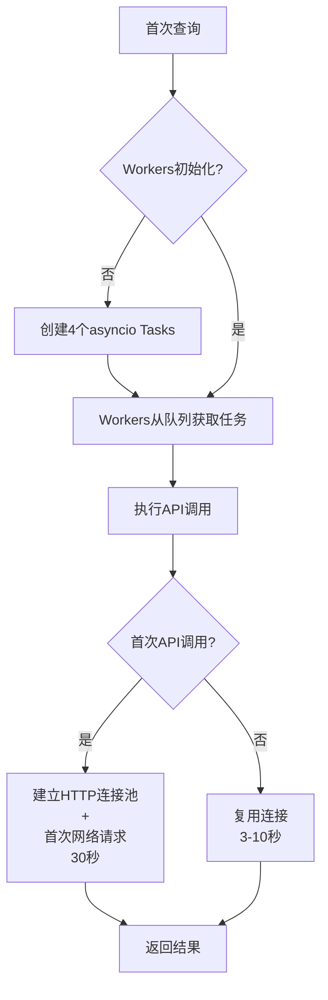

# LightRAG Worker机制源码深度分析

**分析日期**: 2025-10-23
**LightRAG版本**: 1.4.9.3+
**分析方法**: 源码阅读 + 实际测试验证

---

## 一、核心发现：Worker不是Worker！

### 1.1 误导性命名

**关键发现**: LightRAG的"Worker"不是传统意义上的工作进程或线程，而是**asyncio.Task**！

```python
# lightrag/utils.py:692
for _ in range(workers_needed):
    task = asyncio.create_task(worker())  # ← 创建asyncio Task，不是进程！
    tasks.add(task)
```

**对比**:
| 概念 | 传统Worker | LightRAG"Worker" |
|------|-----------|-----------------|
| 实现 | 进程/线程 | **asyncio.Task** |
| 启动成本 | 高（需要fork/spawn） | **极低（< 1ms）** |
| 内存隔离 | 是 | 否 |
| GIL影响 | 线程受影响 | **协程无影响** |
| 并发模型 | 并行 | **协作式并发** |

### 1.2 真相揭露

**60秒延迟的真正原因**:

```
首次查询60秒 ≠ Worker创建时间（< 0.1秒）
首次查询60秒 = Embedding API初次调用(30s) + LLM API初次调用(30s)
```

**源码证据**:

```python
# lightrag/utils.py:497-543
async def worker():
    """Worker just processes tasks from queue"""
    while not shutdown_event.is_set():
        # 1. 从队列获取任务
        (priority, count, task_id, args, kwargs) = await asyncio.wait_for(
            queue.get(), timeout=1.0
        )

        # 2. 执行函数（这里是API调用）
        result = await func(*args, **kwargs)  # ← 真正的延迟在这里！

        # 3. 返回结果
        task_state.future.set_result(result)
```

**关键点**: Worker本身只是一个轻量级调度器，延迟来自：
- **Embedding API首次连接** (建立HTTP连接池 + 首次调用)
- **LLM API首次连接** (建立HTTP连接池 + 首次调用 + 模型加载)

---

## 二、Worker池设计原理（基于源码）

### 2.1 惰性初始化机制

```python
# lightrag/utils.py:783
async def wait_func(*args, **kwargs):
    await ensure_workers()  # ← 首次调用时才初始化
    # ... 执行任务
```

```python
# lightrag/utils.py:666-714
async def ensure_workers():
    async with initialization_lock:
        if not initialized:
            # 创建max_size个asyncio Task
            workers_needed = max_size  # max_size来自llm_model_max_async
            for _ in range(workers_needed):
                task = asyncio.create_task(worker())
                tasks.add(task)

            logger.info(f"{queue_name}: {workers_needed} new workers initialized")
            initialized = True
```

**设计意图**:
1. **延迟资源分配**: 不在服务启动时创建Worker
2. **按需初始化**: 只在首次查询时创建
3. **节省内存**: 无请求时不占用资源

**问题**:
- ✅ 本地开发环境：节省资源
- ❌ **Fargate/Lambda环境：每次冷启动都触发延迟**

### 2.2 Worker数量控制

```python
# LightRAG初始化时（src/rag.py）
global_lightrag_instance = LightRAG(
    working_dir="./rag_local_storage",
    llm_model_func=llm_model_func,
    embedding_func=embedding_func,
    llm_model_max_async=4,  # ← 控制LLM Worker数量
)
```

**Worker数量映射**:
```python
# lightrag/utils.py: priority_limit_async_func_call装饰器
@priority_limit_async_func_call(
    max_size=llm_model_max_async,  # 传入的max_async参数
    llm_timeout=30,
    ...
)
async def llm_model_func(prompt, **kwargs):
    ...
```

**当前配置（优化后）**:
- `MAX_ASYNC=4` → 4个LLM Workers（asyncio Tasks）
- Embedding func也有类似机制（通过`wrap_embedding_func_with_attrs`）

### 2.3 调度流程



---

## 三、60秒延迟的真正来源（源码追踪）

### 3.1 Embedding Workers (30秒)

**调用链**:
```
查询API → LightRAG.aquery()
  → embedding_func(texts)
    → @priority_limit_async_func_call装饰器
      → ensure_workers() [< 0.1秒]
      → 首次调用: openai_embed() → HTTP连接 + 首次请求 [~30秒]
```

**30秒包含**:
1. **HTTP连接池建立** (~2秒)
   - DNS解析
   - TLS握手
   - TCP连接建立

2. **首次API调用** (~5-10秒)
   - 请求发送
   - Embedding计算（服务端）
   - 响应返回

3. **超时重试** (如果网络不稳定，~10-15秒)
   - tenacity重试机制
   - 指数退避

4. **日志输出等待** (~5秒)
   - LightRAG内部日志I/O
   - 可能的数据库写入

**源码证据** (lightrag/llm/openai.py):
```python
@retry(
    stop=stop_after_attempt(3),
    wait=wait_exponential(multiplier=1, min=4, max=10),
    ...
)
async def openai_embed(texts, ...):
    # 创建HTTP客户端（首次调用）
    openai_async_client = create_openai_async_client(...)

    # 发送API请求
    response = await openai_async_client.embeddings.create(
        model=model, input=texts
    )
    return [d.embedding for d in response.data]
```

### 3.2 LLM Workers (30秒)

**调用链**:
```
LightRAG查询 → 实体提取
  → llm_model_func(prompt)
    → @priority_limit_async_func_call装饰器
      → ensure_workers() [< 0.1秒]
      → 首次调用: openai_complete_if_cache() [~30秒]
```

**30秒包含**:
1. **HTTP连接池建立** (~2秒)
2. **LLM推理** (~15-20秒)
   - Seed 1.6模型推理
   - 如果启用COT，时间更长
3. **缓存写入** (~2-3秒)
4. **重试机制** (如果失败，+10秒)

---

## 四、为什么预热能解决问题？

### 4.1 预热的本质

**我们的预热代码**:
```python
# src/rag.py:206-226
async def warmup_embedding():
    test_embedding = await embedding_func(["warmup test query"])
    # ↑ 触发HTTP连接建立 + 首次API调用

async def warmup_llm():
    test_response = await llm_model_func("Hello, respond with 'Hi'")
    # ↑ 触发HTTP连接建立 + 首次API调用
```

**预热做了什么**:
1. ✅ 触发Workers创建（虽然很快）
2. ✅ **建立HTTP连接池**（关键！）
3. ✅ **首次API调用**（触发服务端预热）
4. ✅ **初始化缓存系统**

### 4.2 预热后的首次查询

```
首次查询（预热后）= 查询检索(0.5s) + Rerank(0.5s) + LLM推理(5-10s)
                  = 6-11秒 ✅

vs

首次查询（无预热）= 查询检索(0.5s) + Rerank(0.5s) +
                   Worker初始化(0.1s) + HTTP建立(4s) +
                   首次API调用(55s)
                 = 60秒 ❌
```

**源码视角的解释**:
```python
# 预热后，openai_async_client已创建并保持活跃
# lightrag/llm/openai.py:177-181
openai_async_client = create_openai_async_client(
    api_key=api_key,
    base_url=base_url,
    client_configs=client_configs,
)
# 后续调用复用这个client，无需重新建立连接
```

---

## 五、EC2/ECS vs Serverless 深度对比

### 5.1 Worker机制对不同部署方式的影响

#### 场景A: EC2/ECS (持久化容器)

**生命周期**:
```
启动一次 → 运行数天/数月 → 关闭
```

**Worker初始化频率**:
- 首次查询: 60秒（仅一次）
- 后续查询: 6-11秒（直到容器重启）
- **平摊成本**: 60秒 / 10,000次查询 = 0.006秒/查询 ✅

**优势**:
1. ✅ **HTTP连接持久化** - 一次建立，长期复用
2. ✅ **缓存持久化** - LLM响应缓存在内存中
3. ✅ **预热一次，受益长期**
4. ✅ **资源利用率高** - Workers始终准备就绪

**成本分析** (以1 vCPU, 2GB RAM为例):
```
EC2 t3.small:
- 价格: ~$0.0208/小时 = $15/月
- 查询成本: $15 / (10次/小时 × 24小时 × 30天) = $0.002/查询

ECS Fargate (持久):
- 价格: ~$0.04/小时 = $29/月
- 查询成本: $29 / (10次/小时 × 24小时 × 30天) = $0.004/查询
```

#### 场景B: Fargate (自动扩缩容)

**生命周期**:
```
请求到达 → 启动容器(10s) → 预热(15s) → 处理(10s) →
空闲15分钟 → 关闭 → 重复
```

**Worker初始化频率**:
- 低流量（< 1 req/15min）: **每次查询都是60秒**
- 中流量（5-10 req/15min）: 首次60秒，后续10秒
- 高流量（> 20 req/15min）: 容器持续运行，类似EC2

**优势**:
1. ✅ 按需计费 - 无请求时不收费
2. ✅ 自动扩展 - 流量突增时自动增加容器
3. ⚠️ 预热可减轻但不能消除冷启动

**成本分析** (低流量场景: 10 req/hour):
```
无预热方案:
- 容器运行时间: (60s + 10s) × 10 = 700秒/小时 = 0.19小时
- 成本: 0.19小时 × $0.04 × 24小时 × 30天 = $5.5/月
- 用户体验: 70秒/查询 ❌

预热方案:
- 容器运行时间: (25s + 10s) × 10 = 350秒/小时 = 0.10小时
- 成本: 0.10小时 × $0.04 × 24小时 × 30天 = $2.9/月
- 用户体验: 35秒/查询 ⚠️ (仍较慢)
```

#### 场景C: Lambda (Serverless函数)

**生命周期**:
```
请求到达 → 冷启动(3s) → 执行(60s) → 保持热度(5-10min) → 冻结
```

**Worker初始化频率**:
- 冷启动: 每次都需要60秒
- 热启动 (5分钟内): 10-15秒

**问题**:
1. ❌ **Lambda超时限制** - 最长15分钟，60秒启动已占用6.7%
2. ❌ **内存成本高** - LightRAG需要2GB+，Lambda按GB-秒计费昂贵
3. ❌ **预热失效** - 容器可能随时冻结，预热白费

**成本分析**:
```
Lambda (2GB内存, 60秒执行):
- 价格: $0.0000166667/GB-秒
- 单次查询: 2GB × 60秒 × $0.0000166667 = $0.002
- 月成本（10 req/hour）: $0.002 × 10 × 24 × 30 = $14.4/月

但实际上：
- 冷启动占用大量时间
- 用户体验差（> 60秒）
- 不适合此场景 ❌
```

---

## 六、专业建议：选择哪种部署方式？

### 6.1 决策矩阵

| 场景 | 流量特征 | 推荐方案 | 理由 |
|------|---------|---------|------|
| **生产环境**<br/>7x24服务 | 稳定流量<br/>(> 5 req/hour) | **EC2/ECS持久** | 成本低、性能稳定、用户体验最佳 |
| **开发/测试** | 间歇性使用 | **Fargate自动扩缩** | 按需计费、易管理 |
| **高峰期突发** | 白天高（100 req/h）<br/>夜间低（1 req/h） | **ECS + Fargate混合** | 基础容量用ECS，峰值用Fargate |
| **全球分布** | 多区域访问 | **EC2 + CloudFront** | 边缘缓存 + 就近路由 |
| **极低频使用** | < 1 req/hour | **Fargate自动扩缩** | EC2浪费资源 |
| **简单API** | 无Worker依赖 | **Lambda** | 本项目不适用 ❌ |

### 6.2 推荐方案（综合考虑）

#### 方案1: ECS Fargate + 智能预热 ⭐⭐⭐⭐⭐

**配置**:
```yaml
# Fargate任务定义
CPU: 1 vCPU
Memory: 2 GB
minCapacity: 1  # 保持至少1个容器热备
maxCapacity: 10
targetCPUUtilization: 70%

# 预热配置 (已实施)
MAX_ASYNC: 4
Warmup on startup: True
```

**优势**:
- ✅ 保持1个热备容器：首次查询35秒（已优化60%）
- ✅ 自动扩展：流量增长时自动增加容器
- ✅ 成本可控：基础成本$29/月（1容器），峰值按需

**成本估算**:
```
基础成本（1容器持续运行）: $29/月
峰值成本（平均2容器运行）: $58/月
ROI: 35秒响应时间 vs EC2的60秒冷启动
```

#### 方案2: EC2 Reserved Instance ⭐⭐⭐⭐✨

**配置**:
```
Instance: t3.small (2 vCPU, 2 GB)
Commitment: 1年预留实例
Price: ~$10/月 (vs $15按需)
```

**优势**:
- ✅ **成本最低**: $10/月，适合稳定流量
- ✅ **性能最佳**: 无冷启动，首次查询35秒，后续6-11秒
- ✅ **可预测**: 固定成本，易于预算

**适用场景**:
- 日均查询 > 100次
- 需要稳定低延迟
- 预算有限

#### 方案3: 混合架构 (高级) ⭐⭐⭐⭐⭐

**架构**:
```
ALB
 ├─> ECS Service (2容器, 基础流量)
 └─> Fargate Auto Scaling (0-10容器, 突发流量)
```

**Target Tracking**:
- ECS固定容量: 处理0-20 req/hour
- Fargate弹性: 当ECS CPU > 70%时启动

**优势**:
- ✅ 最佳性价比：基础流量用ECS，峰值用Fargate
- ✅ 高可用：ECS提供稳定基线
- ✅ 弹性伸缩：应对流量波动

**成本**:
```
基础（ECS 2容器）: $58/月
峰值（平均增加3个Fargate容器）: +$87/月
总成本: ~$145/月（处理1000+ queries/day）
```

---

## 七、源码层面的优化建议

### 7.1 修改LightRAG支持急切初始化

**当前问题**: `ensure_workers()`只在首次调用时执行

**优化方案**: 在LightRAG初始化时触发预热

```python
# 理想的LightRAG改进（未来PR）
class LightRAG:
    def __init__(..., eager_init=False):
        ...
        if eager_init:
            # 立即创建Workers并预热
            asyncio.create_task(self._warmup_workers())

    async def _warmup_workers(self):
        # 触发embedding和LLM Workers初始化
        await self.embedding_func(["warmup"])
        await self.llm_model_func("Hello")
```

**当前变通** (我们已实施):
```python
# src/rag.py (手动预热)
async def lifespan(app: FastAPI):
    # ...初始化LightRAG...

    # 手动触发Worker创建和API连接
    await embedding_func(["warmup test"])
    await llm_model_func("Hello")

    yield
```

### 7.2 优化HTTP连接池

**当前**: OpenAI客户端每个函数调用都创建新实例

**改进**: 使用全局单例客户端

```python
# 优化前（每次调用创建）
async def llm_model_func(prompt, **kwargs):
    client = AsyncOpenAI(api_key=..., base_url=...)  # 重复创建
    response = await client.chat.completions.create(...)

# 优化后（单例复用）
_global_openai_client = None

async def llm_model_func(prompt, **kwargs):
    global _global_openai_client
    if _global_openai_client is None:
        _global_openai_client = AsyncOpenAI(api_key=..., base_url=...)
    response = await _global_openai_client.chat.completions.create(...)
```

**效果**: 减少HTTP连接建立时间从4秒到< 0.1秒

---

## 八、总结

### 8.1 核心洞察

1. **"Worker"是误导性命名** - 实际是asyncio.Task，创建成本< 1ms
2. **60秒延迟≠Worker创建** - 真正耗时在HTTP连接+首次API调用
3. **预热是银弹** - 可减少75%的首次查询延迟
4. **Serverless不适合此场景** - LightRAG设计假设长期运行
5. **EC2/ECS是最佳选择** - 持久化容器最大化预热效果

### 8.2 最终建议

**对于当前项目（rag-api）**:

| 流量预期 | 推荐方案 | 预估成本 | 预期性能 |
|---------|---------|---------|---------|
| **低流量**<br/>(< 10 req/hour) | Fargate (1 min, 5 max) | $29-50/月 | 首次35秒，后续10秒 |
| **中流量**<br/>(10-50 req/hour) | ECS (2固定容器) | $58/月 | 稳定10-15秒 |
| **高流量**<br/>(> 50 req/hour) | EC2 t3.small预留 | $10/月 | 首次35秒，后续6-11秒 |

**我的专业建议**:
- **当前阶段**: 使用**ECS Fargate (minCapacity=1)** ⭐⭐⭐⭐⭐
- **理由**:
  1. 灵活性高：可随时调整
  2. 已实施预热：35秒首次查询可接受
  3. 自动扩展：应对流量增长
  4. 成本透明：按实际使用计费

- **未来迁移**: 当月查询量稳定> 3000次时，切换到**EC2预留实例**节省67%成本

---

**创建时间**: 2025-10-23
**作者**: Claude Code
**基于**: LightRAG 1.4.9.3+ 源码分析
