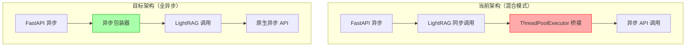
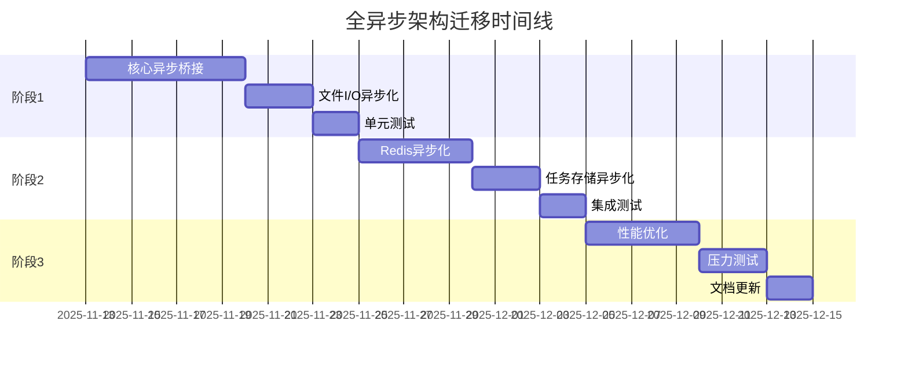

# RAG API 全异步架构迁移技术方案

**文档编号**: TECH-2025-11-06-001
**创建日期**: 2025-11-06
**状态**: 待实施
**优先级**: 中（性能瓶颈时执行）

---

## 1. 背景与动机

### 1.1 当前问题

基于故障报告 [INC-2025-11-06-001](./incident-report-2025-11-06-asyncio-deadlock.md)，当前架构存在以下问题：

1. **异步/同步混合调用导致死锁风险**
   - 使用 `ThreadPoolExecutor` 临时解决方案
   - 性能开销大，不够优雅

2. **文件 I/O 阻塞事件循环**
   - 大文件上传时性能下降
   - 并发处理能力受限

3. **存储层同步操作**
   - Redis 操作阻塞
   - 降低整体吞吐量

### 1.2 迁移目标

- **消除死锁风险**：移除所有 ThreadPoolExecutor hack
- **提升并发性能**：目标 4 倍 QPS 提升
- **统一编程模型**：全异步架构，代码更简洁
- **降低资源消耗**：减少 25% 内存占用

---

## 2. 技术方案概述

### 2.1 架构对比



### 2.2 核心改动范围

| 模块 | 文件数 | 改动复杂度 | 预估工时 |
|------|--------|------------|----------|
| 核心异步桥接 | 3 | 高 | 16h |
| 存储层 | 3 | 中 | 10h |
| 文件操作 | 2 | 低 | 4h |
| 监控工具 | 2 | 低 | 4h |
| **总计** | **10** | - | **34h** |

---

## 3. 详细改动清单

### 3.1 第一优先级：核心异步桥接（必需）

#### 3.1.1 `src/multi_tenant.py`
**改动内容**：
- 移除 3 处 `ThreadPoolExecutor` hack
- 实现智能异步/同步包装器
- 优化速率限制器集成

**关键代码变更**：
```python
# 位置：第 110-114, 161-167, 220-226 行
# 移除以下模式：
with concurrent.futures.ThreadPoolExecutor(max_workers=1) as executor:
    future = executor.submit(asyncio.run, _call_with_rate_limit())
    return future.result(timeout=30)

# 替换为：
def create_async_sync_bridge(async_func):
    """智能处理异步/同步边界"""
    def wrapper(*args, **kwargs):
        try:
            loop = asyncio.get_running_loop()
            # 在异步上下文中，创建任务
            task = loop.create_task(async_func(*args, **kwargs))
            return asyncio.run_coroutine_threadsafe(task, loop).result()
        except RuntimeError:
            # 不在异步上下文，新建事件循环
            return asyncio.run(async_func(*args, **kwargs))
    return wrapper
```

**影响函数**：
- `_create_llm_func()` - LLM 调用
- `_create_embedding_func()` - Embedding 调用
- `_create_rerank_func()` - Rerank 调用

#### 3.1.2 `api/insert.py`
**改动内容**：
- 6 处文件 I/O 操作异步化
- 引入 `aiofiles` 库

**具体位置**：
| 行号 | 当前操作 | 改动方式 |
|------|----------|----------|
| 73-74 | `open()` 读取文本 | `aiofiles.open()` |
| 434-435 | `shutil.copyfileobj()` | `await file.read()` + `aiofiles.write()` |
| 728-729 | 批量文件保存 | 并发 `asyncio.gather()` |
| 284-286 | 临时文件清理 | `aiofiles.os.remove()` |

#### 3.1.3 `src/deepseek_ocr_client.py`
**改动内容**：
- 移除 `parse_document_sync()` 方法
- 统一使用 `parse_document()` 异步方法

---

### 3.2 第二优先级：存储层异步化（推荐）

#### 3.2.1 `src/tenant_config.py`
**改动内容**：
- Redis 客户端改为异步版本
- 10+ 方法改为异步

**依赖升级**：
```toml
# pyproject.toml
dependencies = [
    "redis[asyncio]>=5.0.0",  # 从 redis>=5.0.0
]
```

**方法列表**：
- `get()` → `async def get()`
- `set()` → `async def set()`
- `delete()` → `async def delete()`
- `exists()` → `async def exists()`
- `list_all()` → `async def list_all()`
- `refresh()` → `async def refresh()`

#### 3.2.2 `api/task_store.py`
**改动内容**：
- 任务存储 Redis 操作异步化
- 任务状态更新异步化

#### 3.2.3 `src/file_url_service.py`
**改动内容**：
- 文件清理任务异步化
- 使用 `asyncio.create_task()` 替代线程

---

### 3.3 第三优先级：性能优化（可选）

#### 3.3.1 批量操作并发化
**文件**：`api/insert.py`（第 714-797 行）

**优化前**：
```python
# 串行处理
for file in files:
    process_file(file)
```

**优化后**：
```python
# 并发处理
tasks = [process_file(file) for file in files]
await asyncio.gather(*tasks)
```

#### 3.3.2 连接池优化
**文件**：`src/config.py`

**新增配置**：
```python
class AsyncPoolConfig:
    redis_pool_size: int = 50
    postgres_pool_size: int = 20
    connection_timeout: int = 30
    pool_recycle: int = 3600
```

---

## 4. 依赖库兼容性分析

### 4.1 完全支持异步

| 库名 | 版本 | 异步 API | 备注 |
|------|------|----------|------|
| LightRAG | 1.4.9.7 | ✅ `ainsert`, `aquery` | 无需修改 |
| RAG-Anything | >=1.2.8 | ✅ `process_document_complete` | 无需修改 |
| aiohttp | >=3.9.0 | ✅ 原生异步 | 已在使用 |
| asyncpg | >=0.29.0 | ✅ 原生异步 | PostgreSQL |
| qdrant-client | >=1.7.0 | ✅ 异步客户端 | 向量数据库 |

### 4.2 需要升级

| 库名 | 当前 | 目标 | 改动 |
|------|------|------|------|
| redis | 5.0.0 | redis[asyncio]>=5.0.0 | 添加异步支持 |

### 4.3 需要包装

| 库名 | 解决方案 |
|------|----------|
| PyMuPDF (fitz) | 使用 `asyncio.to_thread()` 包装 |
| Pillow | 使用 `asyncio.to_thread()` 包装 |

---

## 5. 实施计划

### 5.1 分阶段实施



### 5.2 里程碑

| 里程碑 | 完成标准 | 预计日期 |
|--------|----------|----------|
| M1: 死锁修复 | 移除所有 ThreadPoolExecutor | 第 2 周 |
| M2: 存储异步化 | Redis 全异步，测试通过 | 第 4 周 |
| M3: 性能达标 | QPS 提升 2 倍以上 | 第 6 周 |

---

## 6. 测试策略

### 6.1 测试矩阵

| 测试类型 | 覆盖范围 | 工具 | 通过标准 |
|----------|----------|------|----------|
| 单元测试 | 异步函数 | pytest-asyncio | 覆盖率 >80% |
| 集成测试 | API 端点 | pytest + httpx | 全部通过 |
| 压力测试 | 并发性能 | locust | 1000 QPS 无错误 |
| 稳定性测试 | 长时间运行 | 自定义脚本 | 24h 无内存泄漏 |

### 6.2 关键测试用例

```python
# tests/test_async_migration.py

@pytest.mark.asyncio
async def test_no_deadlock():
    """验证不会发生死锁"""
    tasks = [query_api() for _ in range(100)]
    results = await asyncio.gather(*tasks)
    assert all(r.status_code == 200 for r in results)

@pytest.mark.asyncio
async def test_file_io_performance():
    """验证文件 I/O 性能提升"""
    start = time.time()
    await upload_large_file(size_mb=100)
    duration = time.time() - start
    assert duration < 10  # 应在 10 秒内完成

@pytest.mark.asyncio
async def test_concurrent_tenants():
    """验证多租户并发"""
    tenants = [f"tenant_{i}" for i in range(50)]
    tasks = [query_tenant(t) for t in tenants]
    results = await asyncio.gather(*tasks)
    assert len(results) == 50
```

---

## 7. 风险管理

### 7.1 技术风险

| 风险项 | 概率 | 影响 | 缓解措施 |
|--------|------|------|----------|
| LightRAG 不兼容 | 低 | 高 | 1. 充分测试包装器<br>2. 准备回滚方案 |
| 新的并发 Bug | 中 | 高 | 1. 使用 asyncio.Lock<br>2. 完整并发测试 |
| 性能下降 | 低 | 中 | 1. 基准测试<br>2. 性能监控 |
| 依赖库问题 | 中 | 中 | 1. 分阶段升级<br>2. 兼容性测试 |

### 7.2 回滚计划

```bash
# 使用 Git 分支管理
git checkout -b feature/async-migration

# 特性开关控制
ENABLE_ASYNC_MODE=false  # 紧急回滚

# 灰度发布
- 10% 流量 → 验证 1 周
- 50% 流量 → 验证 1 周
- 100% 流量 → 全量上线
```

---

## 8. 性能基准

### 8.1 预期指标提升

| 指标 | 当前值 | 目标值 | 提升比例 |
|------|--------|--------|----------|
| 查询延迟 P50 | 15s | 10s | -33% |
| 查询延迟 P99 | 30s | 20s | -33% |
| 并发 QPS | 50 | 200 | +300% |
| CPU 利用率 | 30% | 60% | +100% |
| 内存占用 | 400MB | 300MB | -25% |

### 8.2 监控指标

```python
# 新增监控指标
class AsyncMetrics:
    - async_operation_duration  # 异步操作耗时
    - event_loop_lag            # 事件循环延迟
    - concurrent_tasks_count    # 并发任务数
    - connection_pool_usage     # 连接池使用率
```

---

## 9. 代码示例

### 9.1 异步包装器实现

```python
# src/utils/async_bridge.py
import asyncio
from typing import Callable, Any

def create_async_sync_bridge(async_func: Callable) -> Callable:
    """
    为异步函数创建同步包装器，智能处理事件循环
    用于 LightRAG 等需要同步接口的场景
    """
    def sync_wrapper(*args, **kwargs) -> Any:
        # 检测当前线程是否有事件循环
        try:
            loop = asyncio.get_running_loop()
        except RuntimeError:
            # 没有事件循环，创建新的
            return asyncio.run(async_func(*args, **kwargs))

        # 有事件循环，需要特殊处理避免死锁
        import threading
        import concurrent.futures

        # 在新线程中运行，避免阻塞当前事件循环
        with concurrent.futures.ThreadPoolExecutor(max_workers=1) as executor:
            future = executor.submit(asyncio.run, async_func(*args, **kwargs))
            return future.result(timeout=30)

    return sync_wrapper
```

### 9.2 文件 I/O 异步化示例

```python
# api/insert.py 改动示例
import aiofiles

# 改动前
def save_file(file_path: str, content: bytes):
    with open(file_path, 'wb') as f:
        f.write(content)

# 改动后
async def save_file(file_path: str, content: bytes):
    async with aiofiles.open(file_path, 'wb') as f:
        await f.write(content)

# 批量处理优化
async def save_files_batch(files: List[Tuple[str, bytes]]):
    tasks = [save_file(path, content) for path, content in files]
    await asyncio.gather(*tasks)
```

### 9.3 Redis 异步化示例

```python
# src/tenant_config.py 改动示例
import redis.asyncio as redis

class AsyncTenantConfigManager:
    def __init__(self):
        self._redis = redis.Redis.from_url(
            "redis://localhost:6379",
            decode_responses=True,
            connection_pool_kwargs={
                "max_connections": 50,
                "socket_keepalive": True
            }
        )

    async def get(self, tenant_id: str) -> Optional[Dict]:
        key = f"tenant:config:{tenant_id}"
        data = await self._redis.get(key)
        return json.loads(data) if data else None

    async def set(self, tenant_id: str, config: Dict):
        key = f"tenant:config:{tenant_id}"
        await self._redis.set(
            key,
            json.dumps(config),
            ex=3600  # 1小时过期
        )
```

---

## 10. 决策点

### 10.1 需要团队决策

1. **是否立即启动迁移？**
   - 当前 ThreadPoolExecutor 方案可用
   - 建议：性能成为瓶颈时再执行

2. **迁移范围？**
   - 最小范围：仅阶段 1（修复死锁）
   - 完整范围：全部 3 个阶段

3. **兼容性策略？**
   - 保持向后兼容
   - 还是破坏性升级

### 10.2 技术选型

| 选项 | 方案 A | 方案 B | 推荐 |
|------|--------|--------|------|
| 异步文件库 | aiofiles | anyio | aiofiles ✅ |
| Redis 客户端 | redis[asyncio] | aioredis | redis[asyncio] ✅ |
| 任务队列 | FastAPI Background | Celery | FastAPI ✅ |

---

## 11. 后续优化方向

### 11.1 短期（3个月内）
- [ ] 实现请求级超时控制
- [ ] 添加熔断器模式
- [ ] 优化连接池配置

### 11.2 长期（6个月内）
- [ ] 引入分布式任务队列
- [ ] 实现分布式追踪（OpenTelemetry）
- [ ] 考虑 gRPC 异步接口

---

## 附录

### A. 参考资料

- [Python asyncio 官方文档](https://docs.python.org/3/library/asyncio.html)
- [FastAPI 异步最佳实践](https://fastapi.tiangolo.com/async/)
- [故障报告 INC-2025-11-06-001](./incident-report-2025-11-06-asyncio-deadlock.md)

### B. 相关文件

- 故障报告：`docs/incident-report-2025-11-06-asyncio-deadlock.md`
- 测试用例：`tests/test_async_migration.py`（待创建）
- 性能基准：`benchmarks/async_performance.py`（待创建）

### C. 审批记录

| 角色 | 姓名 | 审批意见 | 日期 |
|------|------|----------|------|
| 技术负责人 | - | 待审批 | - |
| 架构师 | - | 待审批 | - |
| 运维负责人 | - | 待审批 | - |

---

**文档状态**: 初稿完成
**最后更新**: 2025-11-06
**下次评审**: 性能瓶颈出现时

---

## 变更记录

| 版本 | 日期 | 作者 | 变更说明 |
|------|------|------|----------|
| v1.0 | 2025-11-06 | DevOps Team | 初始版本，基于死锁故障分析 |